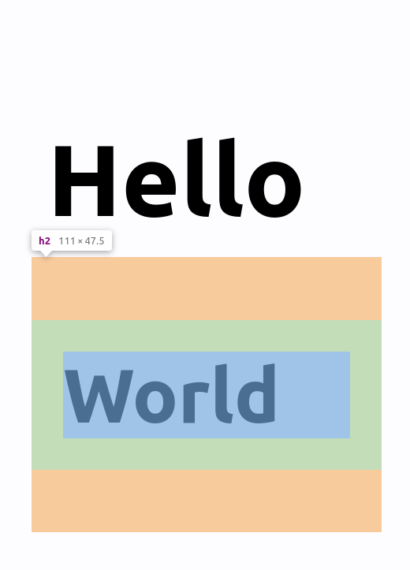

class: center, middle

# CSS runtime performance

## Nolan Lawson, 2022

.muted[Press <kbd>P</kbd> for speaker notes]

???

Hi, my name is Nolan Lawson and today I'd like to talk to you about CSS runtime performance.

---

.center[]

--
.left[
JavaScript
<br/>
(yellow part)
]

--
.right[
<br/>
Style/Layout
(purple part)
]

???

If you're like me, you've spent a lot of time looking at performance traces like this one (in the Chrome DevTools).

And there are two main parts here: the yellow (JavaScript) part, and the purple (style/layout) part.

I think a lot of us look at the JavaScript side of this equation and feel pretty comfortable with it. In there there
are function names we recognize. We see our JavaScript framework doing work, we see our state library crunching data.


But a lot of us probably look at the purple part and think, "Well, that's just the browser doing browser things." I
couldn't possibly understand what that's about.

But the thing is, sometimes that purple part is pretty big. And as it turns out, there _are_ ways to understand what's
going on in there. In this talk, I'd like to shed some light about the "purple part," and give you some tools for
understanding what the browser is doing in there.

---

# Target audience

--
- Performance engineers

--
- Framework authors

--
- Folks working on large web apps

--
- Anyone interested in how browsers work

???

Now first off, I should mention who this talk is for. I'm going to go into a lot of details, and these details aren't
going to be relevant to anyone. What I'm going to cover is mostly going to be interesting to people who deal with
performance all the time, so they're responsible for every part of the performance of their app, including style and layout.
I'm also targeting authors of frameworks and design systems, since their decisions may be multiplied several times, so
it's important to get all the details right. I'm also speaking to people working on large web apps – static content sites
usually don't have performance problems iwth style/layout. I'm also speaking to anyone interested in how browsers work;
some of this stuff is just plain interesting!

---

# How browsers render

.center[]

???


To understand the purple part, we first need to start with how browsers render content. This process is called
["updating the rendering"](https://html.spec.whatwg.org/multipage/webappapis.html#update-the-rendering) in the HTML spec.

This graphic is taken from a blog post on web dot dev where they call it "the pixel pipeline."

You can see that the main steps described here are JavaScript, style/layout, and paint/composite. Helpfully, these
are color-coded in the same way they would be in the Chrome DevTools.

The first step, JavaScript, is where we run some JavaScript that modifies the DOM. Typically this will be your JavaScript
framework rendering, such as React doing its virtual DOM diffing and then eventually putting elements into the DOM.

The next two steps, style and layout, involve applying your CSS to those DOM elements.This is the main thing I want to focus on in this talk.

The last two steps, paint and composite, are about actually writing pixels to the screen and doing animations. I don't want to focus much on these steps (the green part), but I will mention them briefly just to separate them from the purple part.

---

# How browsers render

.center[]

???

Let's focus on the style/layout part

---

.center[]

--
- Style
  - Figuring out which CSS rules apply to which elements

--
- Layout
  - Figuring out how to lay those elements out on the page

???

So let's break down style and layout calculation first. These are two separate steps.

The input of these steps is the state of the DOM – all the CSS rules and DOM nodes.

The output of these steps is the "layout tree" (or "render tree"), and that's the thing
that is passed to the paint (green) step that actually lays out pixels on the screen.

If you take nothing else from my talk, I want you to understand that these are two separate steps, and they
can be slow for two completely different reasons. If your style is slow but you're focused on layout, then
you're chasing ghosts, and vice versa.

---

.center[]

```css
h1 {
  padding: 5px;
}
h2 {
  padding: 10px;
}
```

```html
<h1>Hello</h1>
<h2>World</h2>
```

???

So style calculation is about figuring out which elements have which CSS rules. So let's take a simple example.

In this case, we have a 5px-padding h1 and a 10px-padding h2. So style calculation is the process of figuring out that

---

.center[]

```css
h1 {
* padding: 5px;
}
h2 {
  padding: 10px;
}
```

```html
*<h1>Hello</h1>
<h2>World</h2>
```

???

this h1 is red and 

---

.center[]

```css
h1 {
  padding: 5px;
}
h2 {
* padding: 10px;
}
```

```html
<h1>Hello</h1>
*<h2>World</h2>
```

???

this h2 is blue. I'm simplifying some stuff, but this is mostly what style calculation is about.

In this case, it's about applying the CSS selectors, and figuring out that `h1` refers to the `<h1>` element,
and `h2` refers to the `<h2>` element.

So in a sense, it's almost as if the browser is taking this page, and turning it into this one:

---

.center[]

```html
<h1 style="padding: 5px;" >Hello</h1>
<h2 style="padding: 10px;">World</h2>
```

???

Conceptually, this is what style calculation is: it's giving us the same page we would have had if we had used
inline styles.

---

# Inline styles == no style cost?

--
- Yes.

--
- But it's probably not worth it.

???

Now if you're really clever, you may look at this and think, wait, is he saying that, if I use inline styles all over
the place, my style costs go to zero?

And actually yeah, that's basically what I'm saying. Now there are other parts of style calculation that come into play
here, like inheritance, custom properties, counters, etc., but 99% of your style costs go away if you only use inline styles.

However, if you did this, you would probably end up with a lot of repeated styles all over the place, so you would pay
for it in terms of extra HTML parsing. And it would be harder to maintain. So I'm not advocating this

---

.center[]

--
```html
<h1 style="padding: 5px;" >Hello</h1>
<h2 style="padding: 10px;">World</h2>
```

???

Now let's move on to layout. Note that, with style, at no point were we talking about the geometry of the page.
Style calculation has nothing to do with where things actually go geometrically on the page; that's the job of layout
calculation.

So recall we have our h1 and h2 where the browser has (somehow) figured out that one has 5px padding and the other
has 10px padding (either because our styles are inline or because it ran style calcuation).

---

class: contain-vertical

.center[]


???

Now we finally get to the geometry of the page. Layout calculation is where the styles, which have been associated with
each element, actually get applied. In this case, the browser figures takes the margin, padding, font size, and
figures out where to actually place things within the given browser window, with text wrapping and all that good stuff.

---

class: contain-vertical

.center[]

---

class: contain-vertical

.center[]

???

Again, note that here we're actually talking about the geometry of the page. That's what layout is about.

---

## Style/layout performance

```css
h1 {
  padding: 5px;
}
h2 {
  padding: 10px;
}
```

???

So conceptually, how can we think about the performance implications of style versus layout? What makes one slow
versus the other?

---

## Style/layout performance

```css
*h1 {
  padding: 5px;
}
*h2 {
  padding: 10px;
}
```

???

Well, speaking in generalities, we can say that style calculation is about the part outside of the braces (i.e. selectors)

---

## Style/layout performance

```css
h1 {
* padding: 5px;
}
h2 {
* padding: 10px;
}
```

???

Whereas layout calculation is about the part inside of the braces (i.e. the rules that actually place things geometrically on the page).

---

## Style/layout performance

```html
<div>
  <div>
    <div>
      <div>
        !-- Big DOM tree! -->
      </div>
    </div>
  </div>
</div>
```

???

Both of them are also going to be affected by the number of DOM elements on the page. A larger DOM means more for the browser
to do, in terms of both style and layout. This is why techniques such as virtualization are good at improving both style
and layout performance.