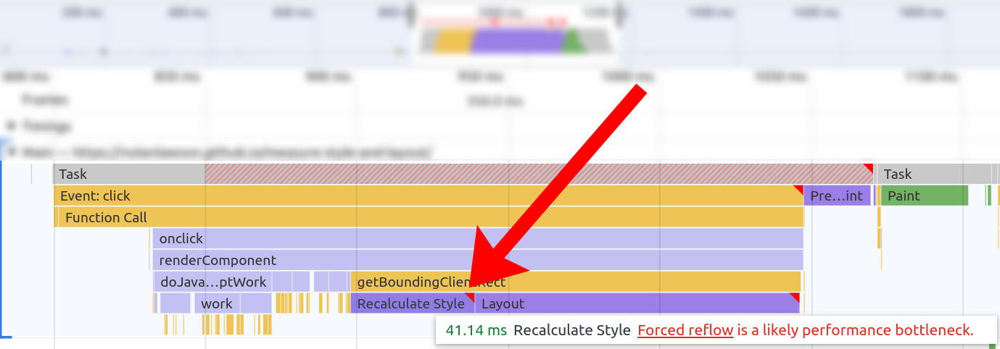
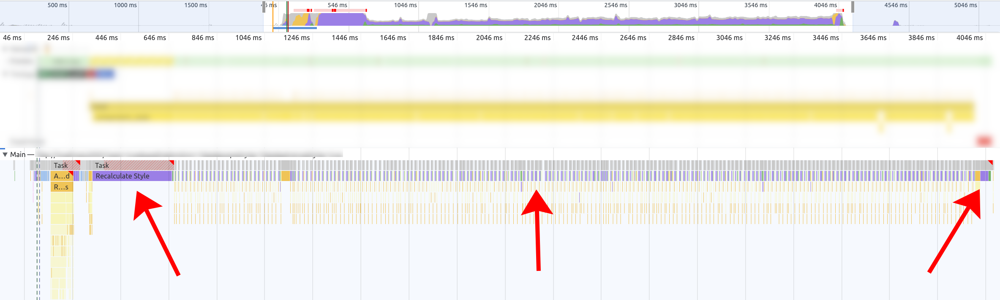

class: center, middle

# CSS runtime performance

## Nolan Lawson, 2022

.muted[Press <kbd>P</kbd> or <toggle-presenter-mode>click here</toggle-presenter-mode> for speaker notes]

???

Hi, my name is Nolan Lawson and today I'd like to talk to you about CSS runtime performance.

Quick note: these slides are available online; I'll provide a URL at the end.

The speaker notes have links with details.

---
.left-column-66[]
.right-column-33[

- `nolanlawson.com`
- Microsoft Edge 2016-2018
- Salesforce 2018-
]
???

So who am I?

If you know me from the internet, it's probably from [my blog](https://nolanlawson.com) where I talk about performance, 
accessibility, web components, etc.

I was on the Microsoft Edge performance team for a couple years, then moved to the performance team at Salesforce,
and now I work on our JavaScript framework, Lightning Web Components.

---

class: contain-vertical

.center[]

<footer class="muted absolute">
  Via <a href="https://www.flickr.com/photos/154073030@N05/28577829138">Flickr</a>
</footer>

???

I'd like to start off with a story. When I was learning to drive as a teenager, my car was a stick shift (manual transmission).
These are much more common in Europe than in the U.S., but growing up in the Seattle area, this is what I had.

It was really difficult! But one thing I like about stick shifts is that you feel more in tune with what the car
is doing. By listening to the sounds of the engine, I developed a feel for when to shift
from one gear to another, or how to do things like "engine braking," which is
actually [an efficient use of fuel](https://jalopnik.com/here-is-when-engine-braking-can-save-more-gas-than-coas-1819484925).

---

class: contain-vertical

.center[]

<footer class="muted absolute">
  Via <a href="https://www.flickr.com/photos/ell-r-brown/3824067984/">Flickr</a>
</footer>

???

Of course, I have no idea how an internal combustion engine actually works. It's a hugely complex thing.

But by listening
to the engine and seeing how it reacted to my actions, I learned how to use an engine efficiently.

---

class: contain-vertical

.center[]

<footer class="muted absolute">
  Via <a href="https://github.com/alrra/browser-logos">alrra/browser-logos</a>
</footer>

???

This is sort of how I feel about web performance. A browser engine is an very complex. And I'm not a C/C++/Rust developer.

But through observation of how the engine responds to my inputs, I can become a better web developer, and write more efficient web apps.

And if you know _just a bit_ about how the engine works, you can be an even better web developer.

---

.center[]

???

Let's look at a browser perf trace like this one (from the Chrome DevTools).

There are two main parts: the yellow (JavaScript) part, and the purple (style/layout) part.

--
.float-left[
JavaScript (yellow part)
]

???

<hr/>

If you're an experienced web dev, you might look at the JavaScript side and feel pretty comfortable with it.

We see names of functions we wrote. We see libraries we installed from npm. We see frameworks like React.

--
.float-right[
Style/Layout (purple part)
]

???

<hr/>

But many people look at the purple part and see a black box. "That's just the browser doing browser things. I
couldn't possibly understand that."

Or we say "the purple part doesn't matter." As if the user cares whether their click was delayed by the yellow part or purple part!

This is kind of a "learned helplessness." We feel helpless, so we try to tell ourselves it doesn't matter.

In this talk, I'd like to convince you that the purple part _can_ matter, and that you _can_ understand what's going on in there.

---
<h1 class="smaller">Three news sites</h1>

.center[]

???

Style/layout performance can be important.

To prove my point, I ran WebPageTest (simulated Moto G4, 4G) on three major news websites that I chose basically at random.
Then I categorized the time spent on the main thread in the trace as Loading (network), Scripting (JS),
Rendering (Style/Layout), or Paint.

As you can see, the purple part is not the most important part, but it can be quite big. For the third site in particular,
it's worth looking into.

And even for the others, in absolute terms, 2.6s and 3.5s are pretty big! If we can find some quick wins here, that would be great.

---
exclude: true
# Target audience

???

I should mention who I designed this talk for. A few groups of people:

--
exclude: true
- ⚡ Performance engineers

???

Perf folks are going to be interested in every part of the performance equation, including style/layout, even if it's
not the #1 most important thing all of the time.

--
exclude: true
- 🛠️ Framework authors

???

If you're building a JavaScript framework or design system, then small decisions in your CSS
can have large cascading effects downstream.

--
exclude: true
- 🌍 Complex webapp authors

???

Large web apps (e.g. SPAs) tend to have more problems with style/layout than static content sites. (Although
as you saw with the 3 news sites, they can have high style/layout costs too.)

--
exclude: true
- 🙋 Anyone interested in how browsers work

???

I'm also speaking to anyone interested in how browsers work. This stuff is just plain interesting!

---

# How browsers render

.center[]

<footer class="muted absolute">
  Via <a href="https://web.dev/rendering-performance/#the-pixel-pipeline">web.dev</a>
</footer>

???

To understand the purple part, we first need to start with how browsers render content. This process is called
["updating the rendering"](https://html.spec.whatwg.org/multipage/webappapis.html#update-the-rendering) in the HTML spec.

The first step, JavaScript, is where we run some JavaScript that modifies the DOM. Typically this will be your JavaScript
framework rendering, such as React doing its virtual DOM diffing and then eventually putting elements into the DOM.

The next two steps, style and layout, involve applying your CSS to those DOM elements and then laying them out on the page. This is my focus.

The last two steps, paint and composite, are about actually writing pixels to the screen and doing animations. This part is largely
out of scope for this talk.

---

# How browsers render

.center[]

???

Let's focus on the style/layout part.

---

.center[]

???

So let's break down style and layout calculation first. These are two separate steps.

--
.float-left[]

???

With style, we're figuring out which CSS rules apply to which elements and computing styles.

--
.float-right[]

<footer class="muted absolute">Illustrations by <a href="https://hacks.mozilla.org/2017/08/inside-a-super-fast-css-engine-quantum-css-aka-stylo/">Lin Clark</a></footer>

???

With layout, we're figuring out how to place those elements geometrically on the page.

The output of these steps is the calculated layout of the page, which is
passed to the paint (green) step that actually lays out pixels on the screen.

---

.center[]

```css
h1 {
  padding: 5px;
}
h2 {
  padding: 10px;
}
```

```html
<h1>Hello</h1>
<h2>World</h2>
```

???

So style calculation is about figuring out which elements have which CSS rules. The output of this
is called the ["layout tree" (or "render tree")](https://browser.engineering/layout.html#the-layout-tree).

Let's take a simple example. In this case, we have a 5px-padding h1 and a 10px-padding h2. So style calculation is the process of figuring out that

---

.center[]

```css
*h1 {
* padding: 5px;
*}
h2 {
  padding: 10px;
}
```

```html
*<h1>Hello</h1>
<h2>World</h2>
```

???

this rule applies to this h1

---

.center[]

```css
h1 {
  padding: 5px;
}
*h2 {
* padding: 10px;
*}
```

```html
<h1>Hello</h1>
*<h2>World</h2>
```

???

this rule applies to this h2.

In this case, style calculation is (basically) about applying the CSS selectors, and figuring out that `h1` refers to the `<h1>` element,
and `h2` refers to the `<h2>` element.

So in a sense, it's almost as if the browser is taking this page, and turning it into this one:

---

.center[]

```html
<h1 style="padding: 5px;" >Hello</h1>
<h2 style="padding: 10px;">World</h2>
```

???

Conceptually, this is what style calculation is: it's giving us the same page we would have had if we had used
inline styles.

It's also computing the `em`s, `rem`s, etc. and turning them into `px`s, as well as resolving custom properties, cascade, inheritance, etc, 
but this has less of an impact on perf in my experience.

---

exclude: true

# Inline styles == no style cost?

```html
<div style="padding: 5px; margin: 10px; display: flex">
  <div style="flex: 1; color: blue">
    Inline all the things?
  </div>
</div>
```

???

Now if you're really clever, you may look at this and think, wait, is he saying that, if I use inline styles all over
the place, my style costs go to zero?

And actually yeah, that's basically what I'm saying. Now there are other parts of style calculation that come into play
here, like inheritance, custom properties, counters, etc., but 99% of your style costs go away if you only use inline styles.

So you may be tempted to "inline all the things."

However, if you did this, you would probably end up with a lot of repeated styles all over the place, so you would pay
for it in terms of extra HTML parsing. And it would be harder to maintain. So I'm not advocating this. CSS is good. Use it!

However, this is a good fact about style calculation to internalize: it's mostly about CSS selectors.

---

.center[]

```html
<h1 style="padding: 5px;" >Hello</h1>
<h2 style="padding: 10px;">World</h2>
```

???

Now let's move on to layout. Conceptually, the output of style is the "inline styles," and that's the input to layout.

---

class: contain-vertical

.center[]


???

Now we finally get to the geometry of the page. Layout calculation is where the styles, which have been associated with
each element, actually get applied.

In this case, the browser figures takes the margin, padding, font size, and
figures out where to actually place things within the given browser window, with text wrapping and all that good stuff.

---

exclude: true

# Style vs layout performance

```css
h1 {
  padding: 5px;
}
h2 {
  padding: 10px;
}
```

???

So how to think about style vs layout performance? One way to think about it is...

---

exclude: true

# Style vs layout performance

```css
*h1 {
  padding: 5px;
}
*h2 {
  padding: 10px;
}
```

???

...that style calculation is about the part outside of the braces

---

exclude: true

# Style vs layout performance

```css
h1 {
* padding: 5px;
}
h2 {
* padding: 10px;
}
```

???

..whereas layout calculation is about the part inside of the braces.


---

# Style vs layout performance

.center[]

???

Now first off, when you're looking at a perf trace, it's important to understand whether you primarily have a
problem with style calculation, layout calculation, or both. Because these two traces are not the same!

---

# Style vs layout performance

.center[]

???

These two look similar because they're both purple. But in one trace, we have huge style costs, and in the other,
we have huge layout costs. The causes of slowness in these two cases is very different!

If you don't remember anything else from my talk, please remember this: style and layout are not the same thing! And you
can actually reason about why one is expensive versus the other.

---

<h1 class="smaller">Three news sites</h1>

.center[]

???

Just to give an idea of what the style vs layout breakdown might look like, here are those three news sites
from earlier. Layout is usually the biggest part, but style is occasionally pretty big. In fact, for the first site, it's spending
slightly more time in style than in layout. I've also seen traces where style is almost 100% of the style/layout cost.

---

# What slows down style/layout

|                                 | Style  | Layout |
|---------------------------------|:------:|:------:|
| Complexity of CSS               |   🐌   |        |
| Complexity of layout            |        |   🐌   |
| DOM size                        |   🐌   |    🐌    |
| Repeated re-renders (thrashing) |    🐌    |    🐌    |

???

At a high level, if you're seeing a large amount of time spent in style or layout, it usually comes down to one of these things.

--
<pointing-arrow></pointing-arrow>

???

Typically either your CSS selectors are too complex, or there are a lot of them, which slows down style calculation.
Note this has no effect on layout calculation.

--
<pointing-arrow></pointing-arrow>

???

Or your layout itself, i.e. the geometry of the page, is very large or complex, which slows down layout calculation. Note this has no effect on style calculation.

--
<pointing-arrow></pointing-arrow>

???

Or your DOM is very large. A bigger DOM just means more work for the browser to do. This affects both style and layout.

--
<pointing-arrow></pointing-arrow>

???

Or you are doing repeated re-renders over time, also called thrashing, which slows down both style and layout.

---

class: center,middle

# Style performance

???

To understand style vs layout performance a bit more, we need to go into detail on how each one works. Let's go into style.

---

class: contain-vertical

.center[]


<footer class="muted absolute">Illustration by <a href="https://hacks.mozilla.org/2017/08/inside-a-super-fast-css-engine-quantum-css-aka-stylo/">Lin Clark</a></footer>

???

Remember, this is about matching up CSS rules with DOM nodes, and computing styles.


---

# Selector performance

> "For most websites I would posit that selector performance is not the best area to spend your time trying to find performance optimizations."

.muted.right[– Greg Whitworth, via [Enduring CSS](https://ecss.benfrain.com/) by Ben Frain (2016)] 

???

When we talk about style performance, we're mostly talking about selector performance. This needs some clarification.

There's a very common refrain in the web development community that CSS selector performance "doesn't matter" or you shouldn't worry about it. Here is one representative quote Greg Whitworth. I'm picking on Greg because I work with him, but if you Google
"CSS performance," you'll see this [repeated](https://calendar.perfplanet.com/2011/css-selector-performance-has-changed-for-the-better/) [in](https://calibreapp.com/blog/css-performance) [multiple](https://ecss.benfrain.com/appendix2.html) [places](https://meiert.com/en/blog/performance-of-css-selectors-2/).

I think this is true at the micro level: if you try to micro-optimize your CSS selectors, you're probably wasting your time. But
it's less true at the macro level: if you're building a framework or design system, or if you're writing selector patterns
that are repeated multiple times on a page, then selector performance can really matter.

I've seen perf regressions that were almost entirely driven by selector performance. And if you see high style calculation
costs, then you very likely have a selector perf problem too. So we need to discover the "lost art" of selector performance.

---

# Naïve style calculation

```js
for (const element of page) {
  for (const rule of cssRules) {
    if (rule.matches(element)) {
      /* ... */
    }
  }
}
```

???

To understand style performance, first it's important to note how browsers actually implement their style engines, and what they've
already optimized.

To illustrate, let's imagine we're building a browser. Here is a naive implementation of style calculation that we might have.
--
.center[`O(n * m)`]

???

Unfortunately this naive implementation has a big problem: this is an `O(n * m)` operation, where `n` is the number of elements and `m` is the number of CSS rules. On any reasonably-sized page, the browser would slow to a crawl. So browsers try to avoid this naive case
wherever possible.


---

class: fill-custom

<example-1></example-1>

???

For example, let's look at a simple DOM tree. In this case, we have multiple selectors in our stylesheet, and we
need to match them with DOM nodes.

---


class: fill-custom

<example-1 animate="true" slow="true"></example-1>

???


If we were doing the naive approach, then the browser would have to walk through the entire DOM, plus every selector
for every DOM.

You can see how this would be inefficient, especially if it runs every time the DOM changes!

---

# Style optimization 1: hash maps

- Tags: `span` → `span`, `a` → `a:last-child`
- IDs: `bar` → `#bar`
- Classes: `foo` → `.foo`

???

So let's add a simple optimization to our toy browser. For every tag name, ID, and class, we'll create a hashmap
mapping those strings to the list of selectors for that string.

This is pretty reasonable, because tag names for an element never change, and IDs and classes are pretty small and simple most of the time.

- [Chromium source](https://chromium.googlesource.com/chromium/src/+/993ea953282d39b23658448d4a3f95ffeff310d3/third_party/blink/renderer/core/css/element_rule_collector.cc#522)
- [Firefox source](https://hg.mozilla.org/mozilla-central/file/cf3860b3652e0a2105ab963c2c0dec25c033527a/servo/components/style/selector_map.rs#l70)
- [WebKit source](https://github.com/WebKit/WebKit/blob/7384255396ccd97db7ad12e77963ee283ced2955/Source/WebCore/style/ElementRuleCollector.cpp#L179-L214)

---

class: fill-custom

<example-1></example-1>

???

As you can see, this has a big impact of the efficiency of our algorithm. Rather than checking all selectors, we can
short-circuit to only those selectors that could possibly match

---

class: fill-custom

<example-1 animate="true"></example-1>

???

As you can see, this has a big impact of the efficiency of our algorithm. Rather than checking all selectors, we can
short-circuit to only those selectors that could possibly match

---

class: fill-custom

<example-2></example-2>

???

Now, there's still a problem with our algorithm. What about descendant selectors? In this case, we need to find all
`.bar` elements inside of a `.foo`.

---

class: fill-custom

<example-2 animate="true" strategy="naive-descendant"></example-2>

???

So we have to traverse the descendants of `.foo` to try to find all the `.bar` elements.

Thanks to the hashmap, we can quickly find the `.foo` elements, but this is still pretty inefficient. We're walking a
lot of DOM nodes just to find the `.bar` elements.

---

class: contain-vertical-no-fill

<h1 class="smaller">Style optimization 2: right-to-left</h1>

.center[]

???

So here's another optimization we can do. How about instead of walking from the left to the right, we evaluate the
selector from _right to left_?

So instead of going `foo` then `bar`, we would go `bar` then `foo`.

---

class: fill-custom

<example-2></example-2>

???

Here is our same DOM tree from before.

---

class: fill-custom

<example-2 animate="true" strategy="naive-ancestor"></example-2>

???

It turns out we check a lot fewer DOM nodes this way.

You may have heard that [browser engines evaluate CSS selectors from right to left](ttps://css-tricks.com/why-browsers-read-selectors-right-to-left/).
If you've ever wondered why,
this is the reason! Any given node in the DOM tree tends to have fewer ancestors than descendants, so this optimization
works out really well for most DOM trees.

---

# Problem: generic descendants

```css
.foo div
```

???

This right-to-left technique works out pretty well. But we have another problem. What about selectors like this one?

The right-hand-side (i.e. the descendant) is pretty generic. Most DOM trees have a lot of `div`s.

---

class: fill-custom

<example-3 show-tags="true"></example-3>

???

Consider this DOM tree, where we have a lot of divs and want to find `.foo div`.

---

class: fill-custom

<example-3 show-tags="true" animate="true" strategy="naive-ancestor"></example-3>

???

With the right-to-left technique, we're able to instantly find every `div` (thanks to the hashmap), but we have
to crawl up the entire ancestor chain every time just to find `.foo`. So this is a case where it would
have been faster for us to go left-to-right.

But we just established that left-to-right is pretty slow most of the time, since DOM nodes tend to have more
descendants than ancestors, just due to the shape of the tree. So how can we solve this?

---

# Style optimization 3: Bloom filter

.center[]

<footer class="muted absolute">Via <a href="https://commons.wikimedia.org/wiki/File:Bloom_filter.svg">Wikipedia</a></footer>

???

Enter the Bloom filter. [WebKit](https://github.com/servo/servo/wiki/Css-selector-matching-meeting-2013-07-19) began using this technique in 2011.
All browsers have it now.

You can think of a Bloom filter as a Hash Set that may give false positives, but never gives false negatives. It's fast and has low memory overhead.

Here, we hash the strings x, y, and z, and insert them into the Bloom filter. Then we check if w is in there by hashing it.


---

class: fill-custom

<example-3 show-tags="true" show-bloom-filter="true"></example-3>

???

How does this work in the DOM tree? Well basically, the browser keeps a little Bloom filter hash on each node of its parents'
tag name, IDs, and classes.

This means that if we're on `div`, and we want to figure out if `.foo` is an ancestor, then we don't have to walk up the tree – we know
instantly, because `.foo` is in the Bloom filter.

This particular optimization was first applied by WebKit [in 2011](https://bugs.webkit.org/show_bug.cgi?id=53880) and now
all browsers have it.

---

class: fill-custom

<example-3 show-tags="true" show-bloom-filter="true" animate="true" strategy="bloom-filter"></example-3>

???

So now we can quickly filter all the `divs` based on the Bloom filter, "fast rejecting" any
that couldn't possibly have `.foo` as an ancestor.

Note that, because we could have false positives, we still
need to walk the ancestor chain to check that it really has `.foo` as an ancestor, but we are still eliminating a lot
of work.

Bloom filters can also be tuned to minimize the number of false positives. It's basically a memory vs CPU tradeoff.

---

<h1 class="smaller">What's in the Bloom filter?</h1>

| Supported? | Type                | Example                                       |
|------------|---------------------|-----------------------------------------------|
| ✅          | ID                  | `#id div`                                     |
| ✅          | Class️              | `.foo div`                                    |
| ✅          | Tag️                | `main div`                                    |
| ✅          | Attribute 🆕        | `[foo] div`                                   |
| ⚠️| Attribute value 🆕  | `[foo="bar"] div`                             |
| ❌️        | Other stuff         | `:nth-child(2) div` |

???

So what's in the Bloom filter?

--
<pointing-arrow></pointing-arrow>
<pointing-arrow show-previous="1"></pointing-arrow>
<pointing-arrow show-previous="2"></pointing-arrow>

???

Originally it was only IDs, classes, and tags.

--
<pointing-arrow></pointing-arrow>
<pointing-arrow show-previous="1"></pointing-arrow>

???

<hr/>

In 2018 [WebKit](https://trac.webkit.org/changeset/229090/webkit) added attributes, and
[Firefox](https://bugzilla.mozilla.org/show_bug.cgi?id=1704551) and [Chrome](https://bugs.chromium.org/p/chromium/issues/detail?id=1196474) added them in 2021 after I filed bugs on them.

Note that the attribute optimization
only applies to attribute names, not values, but attribute value selectors can kind of piggyback off of them because
the browser will quickly check if any ancestors even have the attribute name, before checking the value.

--
<pointing-arrow></pointing-arrow>

???

<hr/>

Other stuff could be optimized in theory, but last I checked (late 2022), no browsers have expanded the Bloom filter to anything else.

Bloom filter source:

- [WebKit](https://github.com/WebKit/WebKit/blob/596fdf7c2cec599f8c826787363c54c4b008a7fe/Source/WebCore/css/SelectorFilter.h#L57-L60)
- [Chromium](https://chromium.googlesource.com/chromium/src/+/refs/tags/107.0.5258.1/third_party/blink/renderer/core/css/selector_filter.cc#43)
- [Firefox](https://phabricator.services.mozilla.com/source/mozilla-central/browse/default/servo/components/style/bloom.rs$114)

---

# Browser style optimizations

???

Now, there are many more browser style optimizations than what I've mentioned here. Here are a few more.

--
- WebKit CSS JIT (2014)

???
WebKit has a JIT where they actually compile some selectors directly to assembly. Pretty impressive!

--
- Firefox Stylo (2017)

???

Firefox brought their Stylo  engine over from Servo, which is a very fast multithreaded style calculation engine and
also has some other clever optimizations like the "Rule Tree."

--
- WebKit `:has` (2022)

???

And recently both Webkit and Chromium
implemented `:has()`, which can be thought of as an ancestor selector. (How did they make this fast? You guessed it... another
Bloom filter. Like the other one, this one has classes, IDs, tags, and attributes, but it also adds `:hover`, and they hint
that they may add other pseudo classes later.)

My goal in telling you all this is not to tell you to use this CSS selector or this other one. That information could quickly become outdated.
My goal instead is to give you an appreciation for all the work a browser has to do to do style calculation. So when you see high style
calculation costs, you understand that a browser is doing some non-trivial work.

Notes:

- [WebKit CSS JIT Compiler](https://webkit.org/blog/3271/webkit-css-selector-jit-compiler/)
- [More on WebKit JIT](https://speakerdeck.com/constellation/css-jit-just-in-time-compiled-css-selectors-in-webkit)
- [Firefox Stylo](https://hacks.mozilla.org/2017/08/inside-a-super-fast-css-engine-quantum-css-aka-stylo/)
- [Webkit `has()` pseudo-class](https://webkit.org/blog/13096/css-has-pseudo-class/)
- [WebKit `has()` optimization](https://github.com/WebKit/WebKit/commit/596fdf7c2cec599f8c826787363c54c4b008a7fe)
- [Chromium `:has()` optimization](https://bugs.chromium.org/p/chromium/issues/detail?id=1341893)

---

# Improving style calculation

???

So now, knowing a bit more about how browsers work under the hood, what can we as web developers do if we see high style
calculation costs?

---

# Remove unused CSS

.center[]

???

Well, one thing you can do to reduce style calculation costs is to remove unused CSS. (The example shows a screenshot from Chrome Dev Tools "Coverage" tool.)

After all, the browser doesn't _know_ your CSS is unused until it runs the algorithm to determine that it's unused. And it may have to
run this algorithm every time something on the page changes. So unused CSS can cost you on the main thread throughout the
lifetime of your web app.

So trim that unused CSS!

---

# Avoid excessive complexity in selectors

```css
[class*="foo"] :nth-child(2) > p ~ *
```

???

These kinds of selectors are cute, but if we imagine matching right-to-left, we can see why they might be expensive.

Now, you can probably have a few of these on your page and you'll be fine. It's more of a problem at the
macro level, e.g. if you're building a framework or design system that repeats these selectors multiple times.

Some folks use preprocessors like Sass or Less, and it's easy to put something like this in a for-loop.

---

class: relative

<h1 class="smaller">Rough selector cost estimate</h1>

| ~Cost | Type       | Examples                                 |
|--|-----------------|--------------------------------------------|
| ✅ | ID, class, tag  | `#id`&nbsp;&nbsp;&nbsp;`.cls`&nbsp;&nbsp;&nbsp;`a`                         |
| ⚠️| Descendant      | `.foo *`&nbsp;&nbsp;&nbsp;`.foo > *`                 |
| ⚠️| Attribute name  | `[foo]`                      |
| 🌶️️| Attribute value | `[foo="bar"]`&nbsp;&nbsp;&nbsp;`[foo*="bar"]`              |
| 🌶️ | Sibling         | `.foo ~ *`&nbsp;&nbsp;&nbsp;`.foo + *`                |
| 🌶️ | Pseudo-class    | `:nth-child()`&nbsp;&nbsp;&nbsp;`:not()`&nbsp;&nbsp;&nbsp;`:nth-of-type()` |

???

This is my extremely rough estimate of selector costs.

--
<pointing-arrow></pointing-arrow>

???

In general, browsers have heavily optimized for things like tag names, IDs, and classes.

--
<pointing-arrow></pointing-arrow>
<pointing-arrow show-previous="1"></pointing-arrow>

???

Descendant selectors have the Bloom filter optimize, but it doesn't always work.

Attribute names have historically been less optimized. They're still typically slower than classes, but
[WebKit](https://github.com/WebKit/WebKit/commit/c27218b87632ef954d3e431abe4b585a030e23b2) and [Firefox](https://bugzil.la/1728851)
made optimizations recently (in addition to the Bloom filter optimizations), after I began writing about this on my blog.

--
<pointing-arrow></pointing-arrow>
<pointing-arrow show-previous="1"></pointing-arrow>
<pointing-arrow show-previous="2"></pointing-arrow>

???

Unlike attribute names, attribute values don't go in the hashmap or Bloom filter. Watch out especially for slow "search" selectors.

Sibling selectors tend to be less optimized. Non-adjacent selector and generic right-hand-side can cause [a lot of matching](https://bl.ocks.org/nolanlawson/raw/c1b690c16beead306ab2c4ac7e06c90a/).

Pseudos like `:nth-child()` and `:nth-of-type()` tend to be less optimized, although browsers have specific optimizations for common ones like `:hover` and `:focus`.

--
<stamp-text>IT DEPENDS</stamp-text>

???

But remember: this varies from browser to browser, it could change tomorrow, and there are always exceptions.

---

class: contain-vertical

.center[]

???

To actually understand which selectors are slow, there actually is [a new tool](https://bugs.chromium.org/p/chromium/issues/detail?id=1316060)
released in Chromium earlier this year. If you enable `blink.debug` when using Chrome tracing...

---

class: contain-vertical

.center[]

???

Then you can get this view of the "selector stats." If you sort by elapsed time, you can actually see your
most expensive CSS rules ranked from most to least expensive.

---

class: smaller-table

| Elapsed (μs) | Fast reject count | Match attempts | Match count | Selector                                 |
|--------------|-------------------|----------------|-------------|------------------------------------------|
| 2816         | 8579              | 8599           | 0           | `.toastManager .toastContainer > *`      |
| 2029         | 6201              | 8599           | 340         | `.fmwk-button:disabled *`                |
| 792          | 0                 | 481            | 0           | `[dir="rtl"] .fmwk-form-element _label`  |
| 748          | 0                 | 5215           | 0           | `[class*="fmwk-icon-action-"]`           |
| 608          | 0                 | 5215           | 0           | `[class*="fmwk-x-small-size"]`           |
| 602          | 0                 | 8599           | 8202        | `::selection`                            |
| 602          | 0                 | 8599           | 8202        | `*`                                      |
| 598          | 0                 | 13498          | 1584        | `div`                                    |
| 594          | 6883              | 8599           | 1683        | `[fmwk-input_input] ::before`            |
| 573          | 0                 | 5215           | 0           | `[class*="fmwk-col_padded"]`             |
| 516          | 0                 | 440            | 0           | `[dir="rtl"] .fmwk-form-element control` |

???

Here is the same table, blown up a bit.

I also want to draw your attention to the elapsed time on the left. It's in nanoseconds, so those first two selectors
are taking up almost 5 milliseconds. This was taken on a fast MacBook Pro for a real website.
That's a lot of time for two lines of CSS!

We also have match attempts, match count, and fast reject count. Fast reject count is Bloom filter rejections.

Note this tool may be more useful at the macro level than the micro level. Look for repeated patterns coming from
a framework or CSS processor.

---

# Use shadow DOM

```html
<my-component>
  #shadow-root
    <style> div { color: red } </style>
    <div>Hello!</div>
</my-component>
```

???

Shadow DOM is interesting because it encapsulates styles. They don't bleed in and out of this component.

Because of this scoping, this reduces both the `n` and the `m` in our `O (n*m)` algorithm earlier. The browser
doesn't need to check as many rules against as many elements – it's clear which ones can apply to each other.

This has some style calc benefits I'll mention later.

---

# Use scoped styles

```css
:nth-child(2) *            /* Input */
```

```css
.xyz:nth-child(2) .xyz     /* Svelte output */
```

???

An alternative to shadow DOM is to use style scoping from frameworks like Vue, Svelte, or CSS Modules. In a sense,
these "polyfill" shadow DOM style scoping by modifying the selectors with unique classes, tags, or attributes.

There are different ways to do style scoping. But knowing what you know now about how browsers do
style calculation, you can see how this effectively can turn unperformant selectors (like the first one)
into a more performant selectors that leverage the hash map and/or Bloom filter optimizations.

---

class: contain-vertical

.center[]

???

This chart runs my benchmark, median of 25 iterations, on a 2014 Mac Mini. The benchmark generates some random
CSS, and compares running it through various scoping algorithms vs using shadow DOM vs just leaving the styles unscoped.
It uses 1,000 generated "components," with 10 styles per component.

Note though that this is a microbenchmark, and this is not exactly comparing apples-to-apples.
But the point is to show that shadow DOM and scoped styles do have a perf impact.

If you're writing a framework yourself, you may be interested in the differences between the scoping strategies,
which is covered in [my blog post](https://nolanlawson.com/2022/06/22/style-scoping-versus-shadow-dom-which-is-fastest/).


---

class: contain-vertical-no-fill

<h1 class="smaller less-margin">Concatenate stylesheets (Chromium-only)</h1>

.center[]

???

I hesitated to mention this one, because it only applies to Chromium, but it's a big optimization.

It turns out that in Chromium, [one big stylesheet is faster than multiple small stylesheets](https://bugs.chromium.org/p/chromium/issues/detail?id=1337599) for style calculation. It has no impact on Safari or Firefox, and the Chromium devs may fix it eventually, but it's something to be aware of.

In [this benchmark](https://gist.github.com/nolanlawson/214f22ddf5b26ab3e218a9c65faf90fa), this is median of 35 iterations. The styles are exactly the same; it's just the number of
individual `<style>`s that's different. The fastest is to concatenate everything into one big stylesheet.

So the advice would be to concatenate stylesheets as much as possible across pages, similar to how we do concatenation and chunking
for JavaScript modules in bundlers like Webpack. There are implications for cache performance here as well, though, so don't over-concatenate.
Also try to avoid modifying the stylesheets after inserting them; if you do modify them, it's better to keep them separate according to the
Chromium devs.

---

class: center,middle

# Layout performance

???

OK, so now that I've covered all the bases on style performance, I want to move on to layout performance.

---

class: contain-vertical

.center[]

<footer class="muted absolute">Illustration by <a href="https://hacks.mozilla.org/2017/08/inside-a-super-fast-css-engine-quantum-css-aka-stylo/">Lin Clark</a></footer>

???

Remember, this is about the geometry of the page.

---

class: fill-custom

<layout-example-1></layout-example-1>

???

So let's say we have a simple layout like this. We've got a header, a sidebar, and the main content.

Each of these boxes contains other boxes, but the browser already knows which elements have which styles, so it's just
a matter of laying them out.

---

class: fill-custom

<layout-example-1 draw-more-boxes="true" draw-more-boxes-text="true"></layout-example-1>

???

This can get very complicated, because some of these boxes may have absolute/relative positioning,
others may use flexbox, others may use grid, etc.

And the browser has to calculate all the boxes for these things relative to each other.

---

class: fill-custom

<layout-example-1></layout-example-1>

???

So we have our simple layout.

---

class: fill-custom

<layout-example-1 version="2"></layout-example-1>

???

But let's say our main content suddenly takes up a bit more space, so now the sidebar has to shrink.

---

class: fill-custom

<layout-example-1 version="2" draw-more-boxes="true"></layout-example-1>

???

So now the browser has to recalculate the geometry of all these boxes

---

class: fill-custom

<layout-example-1 version="2" draw-more-boxes="true" draw-more-boxes-text="true" text-version="2"></layout-example-1>

???

Why might this happen? Well maybe we ended up with some super long text that pushed the size of the box out. 
If that happens, then the browser might have to recalculate the layout for everything inside the sidebar.

Now as the author of the page, you might know this is never going to happen. And even if it did, you'd
want to clip the text or something anyway. But is there some simpler way we can reassure the browser that
these boxes are never going to change size?

---

# CSS containment

???

Is there a way we can reassure the browser that a change in one box won't affect the other boxes? Yes, it's called
CSS containment.

---

class: fill-custom

<layout-example-1 version="1" draw-text="contain:strict|contain:strict|contain:strict"></layout-example-1>

???

If we apply the CSS `contain: strict` to each of these boxes, then the browser can calculate their sizes independently
of each other. This has the potential to speed up layout performance.

---

class: fill-custom

<layout-example-1 
  version="1" 
  draw-dropdown="true"></layout-example-1>

???

Now, this has some downsides. If there's a dropdown or something that you want to peek out of one box and into another one...

---

class: fill-custom

<layout-example-1
version="1"
draw-text="contain:strict||"
truncate-dropdown="true"
draw-dropdown="true"></layout-example-1>

???

...then it'll get cut off if we use CSS containment, because we promised the browser that one box wouldn't bleed into another.

---

# CSS containment

- `contain: content`
- `contain: strict`

???

Now there are two (major) values: `content` and `strict`. `content` is a little laxer than `strict`, and is easier
to apply more broadly, but it doesn't size itself independently of its descendants. So `strict` is a bit harder to pull off.

My recommendation would be to try applying these to logically separate parts of your page
(sidebars, modals, individual items in a list, etc.), and then measure
and see if it improves layout performance.

---

class: contain-vertical

.center[]

???

It's a bit hard to predict what optimizations a browser will apply, but here is [a benchmark](https://github.com/nolanlawson/css-containment-benchmark) I put together based on one built by Manuel Rego Casasnovas. It renders
100 items, changes the text 100 times, and measures the result. (Median of 25 iterations, 100 items.)

As you can see, in Chrome you get most of the benefit with `contain: content` and don't need to go as far as
`contain: strict`. With Firefox, the benefit only comes with `contain: strict`. In Safari there isn't any effect.

Keep in mind that browsers may implement multiple different optimizations for CSS containment, or none at all. The spec
doesn't require that a browser implement any optimizations – only that the observable effects of containment apply.
Also note that this is just one benchmark, and you may see different results in your own page.

(Also note that I tested in Firefox Nightly, and they seem to have the same perf optimization as Chrome now.)

---

# Encapsulation

|                      | Shadow DOM | CSS containment |
|----------------------|------------|-----------------|
| Encapsulates         | Style      | Layout          |
| Improves first calc? | Yes        | No              |

???

Now, CSS containment is a form of encapsulation. You might recall I also referred to shadow DOM as a form of encapsulation.
What's the difference?

--

<pointing-arrow></pointing-arrow>

???

Well, shadow DOM encapsulates your _styles_ and improves style
calculation. Whereas CSS containment encapsulates your _layout_ and improves layout performance.

So if you have high style costs, CSS containment can't help you. And if you have high layout costs,
shadow DOM can't help.

--

<pointing-arrow></pointing-arrow>

???

Also note that CSS containment can only make _subsequent_ layouts faster. It provides a hint that if one part of the DOM
changed, then another part doesn't need to be invalidated.

Some browsers like Firefox have experimented with doing layouts in parallel, but since no browser actually implements parallel layout, CSS
containment cannot speed up the first layout pass. Whereas for style calculation, shadow DOM can actually improve
style performance for the first style calculation because it's just about reducing the `n` and `m` in that `O(n*m)`
algorithm I mentioned.

---

# Principles of layout performance

???

Other than CSS containment, I can only share a few general tips on improving layout performance.

--

- Explicit is better than implicit

???

First off, explicitly
telling the browser the sizes of things will always be less work than asking it to run its layout algorithm. If you
know the exact width/height of something, you can set the explicit size rather than letting the browser calculate it.
Absolute/relative positioninng is always fast.

--
- Use fewer DOM nodes (e.g. virtualization)

???

Also, of course, use fewer DOM nodes. If you have an infinite-scrolling list, use virtualization so that you're not
rendering a bunch of DOM nodes that are off-screen.

--
- Use `display:none` and `content-visibility`

???

If you use something like `display:none`, it will also avoid paying the layout cost for everything that is currently being hidden.

There is also a new property that you can use called `content-visibility`, that allows the browser to skip rendering
large portions of the page while still allowing them to be searchable with Cmd-F/Ctrl-F.

So I'd say if you have high layout costs, try CSS containment first, then try these techniques.

---

class: center,middle

# Invalidation

???

OK, so now that I've covered the principles of style and layout, and how they're different, I want to move on to
topics that affect both style and layout calculation.

Up to now, we've mostly talked about what happens to a page that calculates style/layout once. But of course, a lot of
us are building very dynamic pages that are constantly changing, so the browser calculates style/layout more than once.
This process is called "invalidation."

---

# Invalidation

<layout-example-2></layout-example-2>

???

Basically it means we are going from one layout state to another state.

This can typically happen for two different reasons: either 1) the DOM changed, and/or 2) the CSS rules changed.

---

# Invalidation


```js
element.style.width = '200px';
```

???

Invalidation could be as simple as this – changing the margin on an element.

---

# Invalidation

.center[]

???

When the browser
detects this, it will automatically re-render during the next style/layout pass, which happens
on the next frame.

That's why, when you call `requestAnimationFrame`, you get the point in time right before the next
style/layout operation.

---

# Forcing style/layout calculation


```js
element.style.width = '200px';   // Invalidate

element.getBoundingClientRect(); // Force style/layout
```


???

Now, normally this is fine. But it gets dangerous if you're explicitly telling the browser that you want style
and layout to be calculated immediately, rather than waiting for the next frame.

---

# Forcing style/layout calculation


```js
*element.style.width = '200px';   // Invalidate

element.getBoundingClientRect(); // Force style/layout
```

???

Here we're _invalidating_ by setting the margin on the element to 20px. This doesn't actually
cause the browser to do any style/layout work yet. Normally it would happen in the next frame.

---

# Forcing style/layout calculation


```js
element.style.width = '200px';   // Invalidate

*element.getBoundingClientRect(); // Force style/layout
```

???

But instead, we immediately call `element.getBoundingClientRect()`. This forces the browser to immediately
and synchronously calculate both style and layout.

---

# APIs that force style/layout recalc

- `getBoundingClientRect`
- `offsetWidth`
- `getComputedStyle`
- `innerText` 🤯
- etc.

???

Paul Irish has [a complete list]((https://gist.github.com/paulirish/5d52fb081b3570c81e3a) of APIs that force
style/layout recalc.

Some APIs are a bit suprising (like `innerText`). Some force style _and_ layout, whereas others only force style (e.g.
`getComputedStyle`).

---

# Layout thrashing

```js 
for (const el of elements) {
  const width = el.parentElement.offsetWidth;
  el.style.width = width + 'px';
}
```

???

This leads us to layout thrashing.

Layout thrashing is a situation where, in a loop, you're both writing to the DOM (invalidating) 
and writing to the DOM (forcing style/layout). This forces the browser to re-run style and layout repeatedly.

---

# Layout thrashing

```js
for (const el of elements) {
* const width = el.parentElement.offsetWidth;
  el.style.width = width + 'px';
}
```

???

So in this case here we are reading from the DOM

---

# Layout thrashing

```js
for (const el of elements) {
  const width = el.parentElement.offsetWidth;
* el.style.width = width + 'px';
}
```

???

And here we are writing to the DOM

---

.center[]

???

The telltale sign of layout thrashing is these repeated sections of purple
in the DevTools, and the warning about "forced reflow." (Reflow is another name for layout.)

---

# Solving layout thrashing

```js
const widths = elements.map(el => el.parentElement.offsetWidth);

elements.forEach((el, i) => {
  el.style.width = widths[i] + 'px';
});
```

???

In these cases, it's better to batch your reads and writes together.

---

# Solving layout thrashing

```js
*const widths = elements.map(el => el.parentElement.offsetWidth);

elements.forEach((el, i) => {
  el.style.width = widths[i] + 'px';
});
```

???

So that you do all the reads at once...

---

# Solving layout thrashing

```js
const widths = elements.map(el => el.parentElement.offsetWidth);

*elements.forEach((el, i) => {
* el.style.width = widths[i] + 'px';
*});
```

???

...followed by all the writes.

This ensures you only at most pay for style calculation at most twice – once during the reads, and again during
the writes.

---

# Solving layout thrashing

.center[]

???

If you do this correctly, then you should see one big style/layout cost (or at most two) rather than multiple. This allows
the browser to be more efficient because it's doing all the calculations at once rather than piece by piece.

[Demo](https://bl.ocks.org/nolanlawson/raw/6a4e514d16331594bef2d4b9ee91f150/)

---

# Don't be misled

.center[]

???

Note that the DevTools can be misleading. They warn you about "forced reflow" _anytime_ you use one of [the APIs that force style/layout](https://gist.github.com/paulirish/5d52fb081b3570c81e3a), such as `getBoundingClientRect` or `offsetWidth`.

But if you're only reading from the DOM once, then it's useless to eliminate that call; you're just moving the cost around.

---

# Don't be misled

.center[]

???

Here we've gone through a lot of effort to remove that `getBoundingClientRect` call. And the Chrome DevTools
have rewarded us! Our "Recalculate style" doesn't have a little red triangle with a warning anymore.

But the result is the same. All we did was move the style/layout costs from the `getBoundingClientRect` to
the next style/layout calc on the next frame. The total time spent is the same. So this DevTools warning can be very misleading.

[Demo](https://nolanlawson.github.io/measure-style-and-layout/)

---
exclude: true

# Invalidation optimizations

???

Now that said, there are also cases where it seems like an invalidation _should_ happen, but it doesn't, because
browsers have tons of optimizations to try to avoid doing unnecessary work.

--
exclude: true
```js
for (let i = 0; i < 1000; i++) {
  el.style.width = '1px'
  el.getBoundingClientRect()
}
```

???

For instance, this is a fun one. This is layout thrashing, right? In fact this should be awful, right?

Well actually it's not, because browsers have optimized this. Notice that the `1px` never actually changes.

---
exclude: true
# Invalidation optimizations

.center[]

???

If you look at [a demo](https://gist.github.com/nolanlawson/2d70b4f01d1d77ca47f069ad51177ff4) of this code and trace it,
you'll see a very curious thing. We pay the cost of the `getBoundingClientRect`s, sure, but we're only paying yellow
cost, not purple cost. Style and layout is only calculated once. We're just paying the cost of creating the rectangle
objects in JS .

This is a simple expression of a more basic principle: browsers try to avoid doing a full style/layout recalc
when something changes. So if a class changes, it will try to avoid recalculating all styles – only styles related to
that class. Or if the layout changes on one part of the page, it will try to avoid doing layout elsewhere on the
page (although CSS containment helps when these heuristics fail).

More on this topic:

- [Invalidation sets (Chromium)](https://chromium.googlesource.com/chromium/src/+/HEAD/third_party/blink/renderer/core/css/style-invalidation.md)
- [Rule Tree (Firefox)](https://hacks.mozilla.org/2017/08/inside-a-super-fast-css-engine-quantum-css-aka-stylo/)
- [LayoutNG and over-invalidation (Chromium)](https://developer.chrome.com/articles/layoutng/#over-invalidation-and-performance)

---

# Invalidation optimizations

- Invalidation sets (Chromium)
- Rule Tree (Firefox)
- LayoutNG (Chromium)
- Etc.

???

Browsers have a lot of invalidation optimizations. They try to avoid unnecessary work.

You change a class, and they try to only check rules related to that class. You change one part of the DOM, and they try to
only redo layout for that part of the DOM (although containment can help).

- [Invalidation sets (Chromium)](https://chromium.googlesource.com/chromium/src/+/HEAD/third_party/blink/renderer/core/css/style-invalidation.md)
- [Rule Tree (Firefox)](https://hacks.mozilla.org/2017/08/inside-a-super-fast-css-engine-quantum-css-aka-stylo/)
- [LayoutNG and over-invalidation (Chromium)](https://developer.chrome.com/articles/layoutng/#over-invalidation-and-performance)

---

# Typical page flow

.center[]

???

This is why, in the typical flow for a web app, we have a lot of high upfront style/layout costs, and very small
residual style/layout costs on every interaction. This is a good thing – this is what we want.

Sometimes though, these residual costs are surprisingly high. And it can be really tricky to figure out exactly
why something was invalidated and is causing these high residual costs.

---

class: contain-vertical

.center[]

???

One tool you can use to inspect this is "invalidation tracking" in the Chrome DevTools.

Note that this only really works for Chrome – other browsers have different
heuristics and different performance characteristics when it comes to invalidation.

---

class: contain-vertical

.center[]

???

If you do this, and then you click on the "Recalculate style" or "Recalculate Layout" slice in Dev Tools, then
it will show you which CSS rules were invalidated for which elements (in the case of style recalc), or which elements
needed layout (in "recalculate layout"). This can be really invaluable in debugging high invalidation costs!

For instance, you might use this to find out that you have an expensive animation that you're paying for,
even though it's off-screen or otherwise invisible in the DOM.

---
exclude: true
class: contain-vertical

.center[]

???

Another tool you can use is `chrome:tracing`. This provides more low-level details into what Chrome is doing,
albeit it's a bit more inaccessible than the DevTools.

[A good guide on `chrome:tracing`, albeit for V8 debugging](https://v8.dev/docs/rcs))

---
exclude: true

class: contain-vertical

.center[]


???

If you take a trace of a website and then find the "update style" slice, you can get lots of information here.

Some of these are very Chromium-specific. "Matched property cache" is a cache Chromium uses of styles that
are identical between different elements, to save memory.

The really interesting ones are:

- rules fast rejected
- rules matched
- rules rejected

This tells us how many CSS rules matched, and how many were rejected using the "fast reject" method (i.e. the Bloom
filter) and how many were rejected more slowly (using e.g. DOM traversal).

---

# Beware excessive rAFs

```js
(function rAF() {
  requestAnimationFrame(rAF);
})();
```

???

Sometimes invalidation can be really tricky to debug. For instance,
would you expect these rAFs to trigger a style invalidation?

---

class: contain-vertical

.center[]

???

As it turns out, it does in certain cases where animations are involved. I have a [repro](http://bl.ocks.org/nolanlawson/raw/3139d2e2d609531e1ca55b6542ef9705/)
that reproduces this in all 3 engines. (See also [Chrome bug](https://bugs.chromium.org/p/chromium/issues/detail?id=997274).)

This can be a big problem because some people like to use rAF to measure framerate, or implement
a ResizeObserver/IntersectionObserver polyfill,
so they may be calling rAF on every frame. If you do this, then you may end up just paying constant style calculation
costs and causing a battery drain on your page.

---

class: contain-vertical

exclude: true

.center[]

???

Sadly, the Chrome DevTools (or any browser DevTools) do not actually tell you what caused the invalidation.
It just says "Schedule Style Calculation." So you just have to know.

---

# Avoid invalidating global CSS

.center[]

???

Another thing to be aware of with invalidation: not all invalidations are created equal. In
general, invalidating CSS rules is more expensive than invalidating DOM elements. In particular,
when you insert new CSS rules at the global level, the browser (typically) recalculates all
styles for every existing element on the page.

In [this benchmark](https://nolanlawson.com/2022/10/22/style-performance-and-concurrent-rendering/), I'm inserting `<style>` tags in each `rAF`, and you can see the style costs just steadily
increasing, even though I'm not inserting any new DOM nodes.

So the best practice is to batch your CSS rule insertions.

---

exclude: true

# Avoid invalidating global CSS

.center[]

???

So a best practice is to batch your CSS rule insertions. Here I'm running the exact same experiment, but with
inserting new DOM nodes each frame instead of new styles. You can see the costs are much lower overall (about 10x),
and there isn't a steadily increasing growth in style costs.

(You probably still don't want to insert DOM nodes on each `rAF`, but this shows the difference.)

---

class: center,middle

# Conclusion

---

# New CSS features

- Container queries
- `:has` selector
- Cascade layers
- Scoping
- Nesting

???

CSS has been getting a lot of new features recently. Here are some new and draft specs.

---

# New layout features

- Subgrid
- Masonry
- Multi-column layout

???

Layout has been getting new features too.

All of these features are cool, and you should be using them. CSS is great.

---

.center[]

.float-left[
JavaScript (yellow part)
]

.float-right[
Style/Layout (purple part)
]

???

The more work you do in the purple part and the less in the yellow part, the more performant your page will tend to be.

But the more we lean on CSS, and the more ambitious apps we try to build, I worry that we'll see more time spent in the purple part. And it's not good enough to treat it as a black box.

Unfortunately it's harder to understand the purple than the yellow, because JavaScript is **imperative**, whereas CSS is **declarative**. With JavaScript, there's a 1-to-1 mapping between the algorithm we write and the perf trace. Whereas with CSS, we give a big declarative blob to the browser and tell the browser to implement the algorithm.

Browser DevTools are just not very good at showing what's going on here.

---

# SQL

```sql

SELECT height, weight FROM pokemon 
INNER JOIN pokemon_types ON pokemon.id = pokemon_types.id;
```

???

I think there's an interesting analogy here with SQL. Like CSS, SQL is declarative.

And like CSS, SQL has performance considerations. A slow query can result in time spent waiting on the database.

---

# SQL EXPLAIN

```sql
EXPLAIN
SELECT height, weight FROM pokemon 
INNER JOIN pokemon_types ON pokemon.id = pokemon_types.id;
```

???

But unlike CSS, SQL has an EXPLAIN.

---

class: contain-vertical

.center[]

???

If we ask Postgres to EXPLAIN, it'll tell us how many rows it scanned, which indexes it used, how it joined the tables, etc.

So we can map this back to the declarative SQL we wrote.

---

class: contain-vertical

.center[]

<footer class="muted absolute">
  Via <a href="https://www.flickr.com/photos/lex-photographic/26665512361">Flickr</a>
</footer>

???

So wouldn't it be cool if browsers could give us the same thing? A `CSS EXPLAIN`?

Going back to my original metaphor of the stick shift and the car, I'd really like to have a dashboard to give me
more insights into what the browser is doing.

Sure, I can listen to the engine's noises and rely on intuition, but this is not a great way to do perf analysis.

---

| Task                                              | ms  |
|:--------------------------------------------------|-----|
| **Style**                                         | 400 |
| &nbsp;&nbsp;├──&nbsp;&nbsp;Bloom filter misses    | 200 |
| &nbsp;&nbsp;├──&nbsp;&nbsp;Pseudo selectors       | 130 |
| &nbsp;&nbsp;├──&nbsp;&nbsp;Sibling selectors      | 50  |
| &nbsp;&nbsp;└──&nbsp;&nbsp;Custom properties      | 20  |
|                                                   |     |
| **Layout**                                        | 600 |
| &nbsp;&nbsp;├──&nbsp;&nbsp;`<nav>` (grid)         | 300 |
| &nbsp;&nbsp;├──&nbsp;&nbsp;`.sidebar` (flexbox)   | 200 |
| &nbsp;&nbsp;└──&nbsp;&nbsp;`<main>` (normal flow) | 100 |


???

A `SQL EXPLAIN`, but for CSS, would be amazing! Here is a mockup.

---

<h1 class="center">Thank you</h1>

## 📃 nolanlawson.github.io/css-talk-2022

## 🌎 nolanlawson.com

<footer class="muted smaller">
  <p>
  Thanks to Emilio Cobos Álvarez, Manuel Rego Casasnovas, and Daniel Libby for help with research for this talk.
  </p><p>Also thanks to Robert Flack, Steinar Gunderson, and Rune Lillesveen for answering my Chromium style bug questions.
  </p><p>This work is licensed under the <a href="https://creativecommons.org/licenses/by-sa/3.0/)">Creative Commons Attribution Share-Alike License v3.0</a>.
  </p>
</footer>

???

So that's my talk on style/layout performance. I hope you enjoyed it and learned something about how browsers work
and how to optimize style/layout calculation.

Thank you to all the people who helped with research for this talk.

These slides are available online, and you can pop open the speaker notes to find links.

Follow me on my website using RSS!