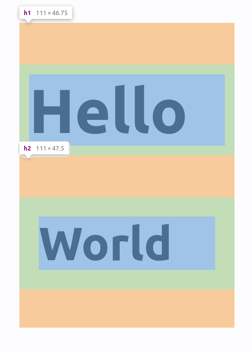

class: center, middle

# CSS runtime performance

## Nolan Lawson, 2022

.muted[Press <kbd>P</kbd> or <toggle-presenter-mode>click here</toggle-presenter-mode> for speaker notes]

???

Hi, my name is Nolan Lawson and today I'd like to talk to you about CSS runtime performance.

---
.left-column-66[]
.right-column-33[

- `nolanlawson.com`
- Microsoft Edge 2016-2018
- Salesforce 2018-
]
???

First off, who am I?

Most likely if you've seen me on the internet, it's from [my blog](https://nolanlawson.com) where I talk about performance, 
accessibility, web components, and various web development topics.

I was on the Microsoft Edge performance team for a couple years, then moved to the performance team at Salesforce,
and now I work on Lightning Web Components at Salesforce, which is our JavaScript framework.

---

class: contain-vertical

.center[]

???

I'd like to start off with a story. When I was learning to drive as a teenager, my car was a stick shift (manual transmission).
These are much more common in Europe than in the U.S., but growing up in the Seattle area, this is what I had.

It was really difficult! But one thing I like about stick shifts is that you feel more in tune with what the car
is doing. By listening to the sounds of the engine, I developed a feel for when to shift
from one gear to another, or how to do things like "engine braking," which is
actually [an efficient use of fuel](https://jalopnik.com/here-is-when-engine-braking-can-save-more-gas-than-coas-1819484925).

[Image source](https://www.flickr.com/photos/154073030@N05/28577829138)

---

class: contain-vertical

.center[]

???

Of course, I have no idea how an internal combustion engine actually works. It's a hugely complex thing. But by listening
to the engine and seeing how it reacted to my actions, I learned a lot about how to use an engine efficiently.

[Image source](https://www.flickr.com/photos/ell-r-brown/3824067984/)

---

class: contain-vertical

.center[]

???

This is sort of how I feel about web performance. A browser engine is an enormously complicated thing, and I'm not a C/C++/Rust developer.

But through observation of how the engine responds to my inputs, I can try to be a better web developer, and write more efficient web apps.

I also think that if you know _just a bit_ about how the engine works, you can be an even better web developer.

[Browser logos source](https://github.com/alrra/browser-logos)

---

.center[]

???

So to take it back to browsers, let's look at a performance trace like this one (from the Chrome DevTools).

If you've worked in performance for a while, you've probably spent a lot of time with these.

And there are two main parts here: the yellow (JavaScript) part, and the purple (style/layout) part.

--
.float-left[
JavaScript (yellow part)
]

???

If you're an experienced web dev, you might look at the JavaScript side and feel pretty comfortable with it. It has
function names we recognize. We see our frameworks and libraries doing work, and our own code doing work.

--
.float-right[
Style/Layout (purple part)
]

???

But a lot of folks look at the purple part, and it's kind of a black box. They think, "That's just the browser doing browser things. I
couldn't possibly understand that." So we shrug our shoulders and don't try to optimize it as much as the yellow part.

---
<h1 class="smaller">Three news sites</h1>

.center[]

???

But the thing is, sometimes that purple part is pretty big. It can have a real impact on web performance.

To prove my point, I ran WebPageTest (simulated Moto G4, 4G) on three major news websites that I chose at random.
Then I categorized the time spent on the main thread in the trace as Loading (network), Scripting (JS),
Rendering (Style/Layout), or Paint.

As you can see, the purple part is not the most important part, but it can be quite big. For the third site in particular,
it's worth looking into. And even for the other ones, if you manage to find a quick win, then there are 2.6s and 3.5s
(respectively) that can be improved! Finding that time in a large JavaScript app can be hard.

---

# Target audience

???

I should mention who I designed this talk for. A few groups of people:

--
- Performance engineers

???

Perf folks are going to be interested in every part of the performance equation, including style/layout, even if it's
not the #1 most important thing all of the time.

--
- Framework authors

???

If you're building a JavaScript framework or design system, then really small decisions you make about how to architect
your CSS or HTML can have large cascading effects downstream.

--
- Folks working on large web apps

???

Large web apps (e.g. SPAs) usually tend to have bigger problems with style/layout than static content sites. Although
as you saw with the 3 news sites, this isn't always the case.

--
- Anyone interested in how browsers work

???

I'm also speaking to anyone interested in how browsers work. Some of this stuff is just plain interesting!

---

# How browsers render

.center[]

???


To understand the purple part, we first need to start with how browsers render content. This process is called
["updating the rendering"](https://html.spec.whatwg.org/multipage/webappapis.html#update-the-rendering) in the HTML spec.

This graphic is taken from [a blog post on web dot dev](https://web.dev/rendering-performance/#the-pixel-pipeline) where they call it "the pixel pipeline."

The main steps here are JavaScript, style/layout, and paint/composite. Helpfully, these
are color-coded in the same way they would be in the Chrome DevTools.

The first step, JavaScript, is where we run some JavaScript that modifies the DOM. Typically this will be your JavaScript
framework rendering, such as React doing its virtual DOM diffing and then eventually putting elements into the DOM.

The next two steps, style and layout, involve applying your CSS to those DOM elements and then laying them out on the page. This is my focus.

The last two steps, paint and composite, are about actually writing pixels to the screen and doing animations. This part is largely
out of scope for this talk.

---

# How browsers render

.center[]

???

Let's focus on the style/layout part.

---

.center[]

???

So let's break down style and layout calculation first. These are two separate steps.

--
.float-left[]

???

With style, we're figuring out which CSS rules apply to which elements and computing styles.

--
.float-right[]

<footer class="muted">Illustrations by <a href="https://hacks.mozilla.org/2017/08/inside-a-super-fast-css-engine-quantum-css-aka-stylo/">Lin Clark</a></footer>

???

With layout, we're figuring out how to place those elements geometrically on the page.

The output of these steps is the calculated layout of the page, which is
passed to the paint (green) step that actually lays out pixels on the screen.

---

.center[]

```css
h1 {
  padding: 5px;
}
h2 {
  padding: 10px;
}
```

```html
<h1>Hello</h1>
<h2>World</h2>
```

???

So style calculation is about figuring out which elements have which CSS rules. The output of this
is called the ["layout tree" (or "render tree")](https://browser.engineering/layout.html#the-layout-tree).

Let's take a simple example. In this case, we have a 5px-padding h1 and a 10px-padding h2. So style calculation is the process of figuring out that

---

.center[]

```css
h1 {
* padding: 5px;
}
h2 {
  padding: 10px;
}
```

```html
*<h1>Hello</h1>
<h2>World</h2>
```

???

this h1 is 5px padding and 

---

.center[]

```css
h1 {
  padding: 5px;
}
h2 {
* padding: 10px;
}
```

```html
<h1>Hello</h1>
*<h2>World</h2>
```

???

this h2 is 10px padding.

In this case, style calculation is (basically) about applying the CSS selectors, and figuring out that `h1` refers to the `<h1>` element,
and `h2` refers to the `<h2>` element.

So in a sense, it's almost as if the browser is taking this page, and turning it into this one:

---

.center[]

```html
<h1 style="padding: 5px;" >Hello</h1>
<h2 style="padding: 10px;">World</h2>
```

???

Conceptually, this is what style calculation is: it's giving us the same page we would have had if we had used
inline styles.

It's also computing the `em`s, `rem`s, etc. and turning them into `px`s, as well as resolving custom properties, `calc`s, etc, 
but this has less of an impact on perf in my experience.

---

exclude: true

# Inline styles == no style cost?

```html
<div style="padding: 5px; margin: 10px; display: flex">
  <div style="flex: 1; color: blue">
    Inline all the things?
  </div>
</div>
```

???

Now if you're really clever, you may look at this and think, wait, is he saying that, if I use inline styles all over
the place, my style costs go to zero?

And actually yeah, that's basically what I'm saying. Now there are other parts of style calculation that come into play
here, like inheritance, custom properties, counters, etc., but 99% of your style costs go away if you only use inline styles.

So you may be tempted to "inline all the things."

However, if you did this, you would probably end up with a lot of repeated styles all over the place, so you would pay
for it in terms of extra HTML parsing. And it would be harder to maintain. So I'm not advocating this. CSS is good. Use it!

However, this is a good fact about style calculation to internalize: it's mostly about CSS selectors.

---

.center[]

???

Now let's move on to layout. Note that, with style, at no point were we talking about the geometry of the page.
Style calculation has nothing to do with where things actually go geometrically on the page; that's the job of layout
calculation.

So recall we have our h1 and h2 where the browser has figured out that one has 5px padding and the other
has 10px padding.

--
```html
<h1 style="padding: 5px;" >Hello</h1>
<h2 style="padding: 10px;">World</h2>
```

---

class: contain-vertical

.center[]


???

Now we finally get to the geometry of the page. Layout calculation is where the styles, which have been associated with
each element, actually get applied. In this case, the browser figures takes the margin, padding, font size, and
figures out where to actually place things within the given browser window, with text wrapping and all that good stuff.

---

# What slows down style/layout

|                                 | Style | Layout |
|---------------------------------|:-----:|:------:|
| Size/complexity of CSS          |   ✅   |   ❌    |
| Complexity of layout            |   ❌   |   ✅    |
| Size/depth of DOM               |   ✅   |   ✅    |
| Repeated re-renders (thrashing) |   ✅   |   ✅    |

???

At a high level, if you're seeing a large amount of time spent in style or layout, it usually comes down to one of these things.

--
<pointing-arrow></pointing-arrow>

???

Either your CSS selectors are too complex, or there are a lot of them, which slows down style calculation. Computations like `calc`s and custom properties can also play a role here. Note this has no effect on layout calculation.

--
<pointing-arrow></pointing-arrow>

???

Or your layout itself, i.e. the geometry of the page, is very large or complex, which slows down layout calculation. Note this has no effect on style calculation.

--
<pointing-arrow></pointing-arrow>

???

Or your DOM is very large. A bigger DOM just means more work for the browser to do. This affects both style and layout.

--
<pointing-arrow></pointing-arrow>

???

Or you are doing repeated re-renders over time, also called thrashing, which slows down both style and layout.

---

# Style vs layout performance

.center[]

???

Now first off, when you're looking at a perf trace, it's important to understand whether you primarily have a
problem with style calculation, layout calculation, or both. Because these two traces are not the same!

---

# Style vs layout performance

.center[]

???

These two look similar because they're both purple. But in one trace, we have huge style costs, and in the other, 
we have huge layout costs. The causes of slowness in these two cases is very different!

If you don't remember anything else from my talk, please remember this: style and layout are not the same thing! And you
can actually reason about why one is expensive versus the other.

---

# Style vs layout performance

```css
h1 {
  padding: 5px;
}
h2 {
  padding: 10px;
}
```

???

So conceptually, how can we think about the performance implications of style versus layout? What makes one slow
versus the other?

---

# Style vs layout performance

```css
*h1 {
  padding: 5px;
}
*h2 {
  padding: 10px;
}
```

???

Well, speaking in generalities, we can say that style calculation is about the part outside of the braces (i.e. selectors that locate elements on the page).

---

# Style vs layout performance

```css
h1 {
* padding: 5px;
}
h2 {
* padding: 10px;
}
```

???

Whereas layout calculation is about the part inside of the braces (i.e. the rules that actually place things geometrically on the page).

---

# Style performance

```css
*h1 {
  padding: 5px;
}
*h2 {
  padding: 10px;
}
```

???

To understand style vs layout performance a bit more, we need to go into detail on how each one works. Let's start with style. Remember: this
is the part outside of the braces.

---

# Style performance

> "For most websites I would posit that selector performance is not the best area to spend your time trying to find performance optimizations."

.muted.right[– Greg Whitworth, via [Enduring CSS](https://ecss.benfrain.com/) by Ben Frain (2016)] 

???

Now first off, I want to clear a bit of a misunderstanding. There's a very common refrain in the web development community that CSS selector performance "doesn't matter" or you shouldn't worry about it. Here is one representative quote from my colleague Greg Whitworth, but there are others.

Now to be clear, this is probably true for most sites. However, sometimes you have a large webapp with a lot of CSS, or sometimes your framework or design system may have a flaw that repeats some unperformant CSS selectors all over the place. So I think this may be true at the micro level, but not at the macro level.

Also the proof is in the pudding: if you have high style calculation costs, then it is probably worth looking into selector performance,
since that's the main cost in style calculation.

- https://calendar.perfplanet.com/2011/css-selector-performance-has-changed-for-the-better/
- https://calibreapp.com/blog/css-performance
- https://ecss.benfrain.com/appendix2.html
- https://meiert.com/en/blog/performance-of-css-selectors-2/

---

<h1 class="smaller">Three news sites</h1>

.center[]

???

So for instance, if we take our three news sites from earlier, and if I split their style/layout performance into
style and layout, we can see that style is occasionally pretty big. In fact, for the first site, it's spending
slightly more time in style than in layout. I've also seen traces where style is almost 100% of the style/layout cost.

---

# Naïve style calculation

```js
for (const element of page) {
  for (const rule of cssRules) {
    if (rule.matches(element)) {
      /* ... */
    }
  }
}
```

???

To understand style performance, first it's important to note how browsers actually implement their style engines, so you can understand the kinds of optimizations they have in place so that we don't have to worry about style performance most of the time.

To illustrate, let's imagine we're building a browser. Here is a naive implementation of style calculation that we might have.

Unfortunately this naive implementation has a big problem: this is an `O(n * m)` operation, where `n` is the number of elements and `m` is the number of CSS rules. On any reasonably-sized page, the browser would slow to a crawl. So browsers try to avoid this naive case
wherever possible.

--
.center[`O(n * m)`]

---

class: fill-custom

<example-1></example-1>

???

For example, let's look at a simple DOM tree. In this case, we have multiple selectors in our stylesheet, and we
need to match them with DOM nodes.

---


class: fill-custom

<example-1 animate="true" slow="true"></example-1>

???


If we were doing the naive approach, then the browser would have to walk through the entire DOM, plus every selector
for every DOM.

You can see how this would be inefficient, especially if it runs every time the DOM changes!

---

# Style optimization 1: hash maps

- Tags: `span` → `span`, `a` → `a:last-child`
- IDs: `bar` → `#bar`
- Classes: `foo` → `.foo`

???

So let's add a simple optimization to our toy browser. For every tag name, ID, and class, we'll create a hashmap
mapping those strings to the list of selectors for that string.

This is pretty reasonable, because tag names for an element never change, and IDs and classes are pretty small and simple most of the time.

- [Chromium source](https://chromium.googlesource.com/chromium/src/+/993ea953282d39b23658448d4a3f95ffeff310d3/third_party/blink/renderer/core/css/element_rule_collector.cc#308)
- [Firefox source](https://hg.mozilla.org/mozilla-central/file/cf3860b3652e0a2105ab963c2c0dec25c033527a/servo/components/style/selector_map.rs#l70)
- [WebKit source](https://github.com/WebKit/WebKit/blob/7384255396ccd97db7ad12e77963ee283ced2955/Source/WebCore/style/ElementRuleCollector.cpp#L179-L214)

---

class: fill-custom

<example-1></example-1>

???

As you can see, this has a big impact of the efficiency of our algorithm. Rather than checking all selectors, we can
short-circuit to only those selectors that could possibly match

---

class: fill-custom

<example-1 animate="true"></example-1>

???

As you can see, this has a big impact of the efficiency of our algorithm. Rather than checking all selectors, we can
short-circuit to only those selectors that could possibly match

---

class: fill-custom

<example-2></example-2>

???

Now, there's still a problem with our algorithm. What about descendant selectors? In this case, we need to find all
`.bar` elements inside of a `.foo`.

---

class: fill-custom

<example-2 animate="true" strategy="naive-descendant"></example-2>

???

So we have to traverse the descendants of `.foo` to try to find all the `.bar` elements.

Thanks to the hashmap, we can quickly find the `.foo` elements, but this is still pretty inefficient. We're walking a
lot of DOM nodes just to find the `.bar` elements.

---

class: contain-vertical-no-fill

# Style optimization 2: right-to-left

.center[]

???

So here's another optimization we can do. How about instead of walking from the left to the right, we evaluate the
selector from _right to left_?

So instead of going `foo` then `bar`, we would go `bar` then `foo`.

---

class: fill-custom

<example-2></example-2>

???

Here is our same DOM tree from before.

---

class: fill-custom

<example-2 animate="true" strategy="naive-ancestor"></example-2>

???

It turns out we check a lot fewer DOM nodes this way.

You may have heard that [browser engines evaluate CSS selectors from right to left](ttps://css-tricks.com/why-browsers-read-selectors-right-to-left/).
If you've ever wondered why,
this is the reason! Any given node in the DOM tree tends to have fewer ancestors than descendants, so this optimization
works out really well for most DOM trees.

---

# Problem: generic descendants

```css
.foo div
```

???

This right-to-left technique works out pretty well. But we have another problem. What about selectors like this one?

The right-hand-side (i.e. the descendant) is pretty generic. Most DOM trees have a lot of `div`s.

---

class: fill-custom

<example-3 show-tags="true"></example-3>

???

Consider this DOM tree, where we have a lot of divs and want to find `.foo div`.

---

class: fill-custom

<example-3 show-tags="true" animate="true" strategy="naive-ancestor"></example-3>

???

With the right-to-left technique, we're able to instantly find every `div` (thanks to the hashmap), but we have
to crawl up the entire ancestor chain every time just to find `.foo`. So this is a case where it would
have been faster for us to go left-to-right.

But we just established that left-to-right is pretty slow most of the time, since DOM nodes tend to have more
descendants than ancestors, just due to the shape of the tree. So how can we solve this?

---

# Style optimization 3: Bloom filter

.center[]

???

Enter the Bloom filter. WebKit came up with the optimization first, and now it exists in all browsers.

> "We stole the Bloom filter from [WebKit]. The idea is to optimize cases where the page author writes a descendant combinator and the thing to the [right-hand side] matches a lot, e.g. `.foo div`."
 
– Boris Zbarsky (Mozilla), via [Servo meeting notes](https://github.com/servo/servo/wiki/Css-selector-matching-meeting-2013-07-19) (2013)

So how does the Bloom filter work? Basically, you can think of it as a Hash Set that may give false positives, but never gives false negatives. The main thing is, it's very fast with low memory overhead, so it can be used widely.

In this example, we have x, y, and z, which (let's say) are CSS classes. Each of those strings is hashed and then bits are flipped in the Bloom filter from 0 to 1. If we want to check if the Bloom filter contains x, we hash x again and check up the 1s. Now, because we're spraying 1s all over the place, this might also match some other string. So that's a false positive. But it's a tradeoff we're willing to make since this data structure is so fast.

Taken from https://commons.wikimedia.org/wiki/File:Bloom_filter.svg

---

class: fill-custom

<example-3 show-tags="true" show-bloom-filter="true"></example-3>

???

How does this work in the DOM tree? Well basically, the browser keeps a little Bloom filter hash on each node of its parents'
tag name, IDs, and classes.

This means that if we're on `div`, and we want to figure out if `.foo` is an ancestor, then we don't have to walk up the tree – we know
instantly, because `.foo` is in the Bloom filter.

---

class: fill-custom

<example-3 show-tags="true" show-bloom-filter="true" animate="true" strategy="bloom-filter"></example-3>

???

So now we can quickly filter all the `divs` based on the Bloom filter, "fast rejecting" any
that couldn't possibly have `.foo` as an ancestor. Note that, because we could have false positives, we still
need to walk the ancestor chain to check that it really has `.foo` as an ancestor, but we are still eliminating a lot
of work.

Bloom filters can also be tuned to minimize the number of false positives. It's basically a memory vs CPU tradeoff.

---

<h1 class="smaller">What's in the Bloom filter?</h1>

| Supported? | Type                | Example                                       |
|------------|---------------------|-----------------------------------------------|
| ✅          | ID                  | `#id div`                                     |
| ✅          | Class️              | `.foo div`                                    |
| ✅          | Tag️                | `main div`                                    |
| ✅          | Attribute 🆕        | `[foo] div`                                   |
| ⚠️| Attribute value 🆕  | `[foo="bar"] div`                             |
| ❌️        | Other stuff         | `:nth-child(2) div` |

???

So what's in the Bloom filter?

--
<pointing-arrow></pointing-arrow>
<pointing-arrow show-previous="1"></pointing-arrow>
<pointing-arrow show-previous="2"></pointing-arrow>

???

Originally it was only IDs, classes, and tags.

--
<pointing-arrow></pointing-arrow>
<pointing-arrow show-previous="1"></pointing-arrow>

???

In 2018 WebKit added attributes, and
Firefox and Chrome added them in 2021 when I filed bugs on them (you're welcome). Note that the attribute optimization
only applies to attribute names, not values, but attribute value selectors can kind of piggyback off of them because
the browser will quickly check if any ancestors even have the attribute name, before checking the value.

--
<pointing-arrow></pointing-arrow>

???

Other stuff could be optimized in theory, but last I checked (late 2022), no browsers have expanded the Bloom filter to anything else.

Bugs adding attributes:

- https://trac.webkit.org/changeset/229090/webkit
- https://bugs.chromium.org/p/chromium/issues/detail?id=1196474
- https://bugzilla.mozilla.org/show_bug.cgi?id=1704551

Bloom filter source:

- https://github.com/WebKit/WebKit/blob/596fdf7c2cec599f8c826787363c54c4b008a7fe/Source/WebCore/css/SelectorFilter.h#L57-L60
- https://chromium.googlesource.com/chromium/src/+/refs/tags/107.0.5258.1/third_party/blink/renderer/core/css/selector_filter.cc#43
- https://phabricator.services.mozilla.com/source/mozilla-central/browse/default/servo/components/style/bloom.rs$114


---

# Browser style optimizations

???

Now, there are many more browser style optimizations than what I've mentioned here. Here are a few more.

--
- WebKit CSS JIT (2014)

???
WebKit has a JIT where they actually compile some selectors directly to assembly. Pretty impressive!

--
- Firefox Stylo (2017)

???

Firefox brought their Stylo  engine over from Servo, which is a very fast multithreaded style calculation engine and
also has some other clever optimizations like the "Rule Tree."

--
- WebKit `:has` (2022)

???

And recently both Webkit and Chromium
implemented `:has()`, which can be thought of as an ancestor selector. (How did they make this fast? You guessed it... another
Bloom filter. Like the other one, this one has classes, IDs, tags, and attributes, but it also adds `:hover`, and they hint
that they may add other pseudo classes later.)

My goal in telling you all this is not to tell you to use this CSS selector or this other one. That information could quickly become outdated.
My goal instead is to give you an appreciation for all the work a browser has to do to do style calculation. So when you see high style
calculation costs, you understand that a browser is doing some non-trivial work.

Notes:

- [WebKit CSS JIT Compiler](https://webkit.org/blog/3271/webkit-css-selector-jit-compiler/)
- [More on WebKit JIT](https://speakerdeck.com/constellation/css-jit-just-in-time-compiled-css-selectors-in-webkit)
- [Firefox Stylo](https://hacks.mozilla.org/2017/08/inside-a-super-fast-css-engine-quantum-css-aka-stylo/)
- [Webkit `has()` pseudo-class](https://webkit.org/blog/13096/css-has-pseudo-class/)
- [WebKit `has()` optimization](https://github.com/WebKit/WebKit/commit/596fdf7c2cec599f8c826787363c54c4b008a7fe)
- [Chromium `:has()` optimization](https://bugs.chromium.org/p/chromium/issues/detail?id=1341893)

---

# Improving style calculation

???

So now, knowing a bit more about how browsers work under the hood, what can we as web developers do if we see high style
calculation costs?

---

# Remove unused CSS

.center[]

???

Well, one thing you can do to reduce style calculation costs is to remove unused CSS. (The example shows a screenshot from Chrome Dev Tools "Coverage" tool.)

This is a really important point, because it's an area where unused CSS is actually different from unused JavaScript. Both cost you
in terms of transfer time, and JavaScript costs you in terms of parse and compile time, but unused CSS costs you in terms of parse, compile, _and_
in making all of your style calculations slower. After all, the browser doesn't _know_ your selectors are unused until it runs the style calculation algorithm! This can actually end up costing you multiple times over the lifetime of your page for every style recalculation, or in cases of layout thrashing (which I'll get to later).

So trim that unused CSS!

---

# Avoid excessive complexity in selectors

```css
[class*="foo"] :nth-child(2) > * ~ * {}
```

???

Now, I don't want to get too deep into this, because again, it's hard to predict these kinds of things. But just don't use zany selectors like these.

And if you think I'm exaggerating, the thing is that it's pretty easy to generate stuff like this if you're not careful. Using tools like SASS
and LESS, it's really easy to deeply nest things, or to have for-loops that generate all sorts of `:nth-child()` selectors.

One or two
of these will probably not wreck your page's performance, but in aggregate, these can do a lot of damage.

---

exclude: true

<h1 class="smaller">Rough selector cost estimate</h1>

| ~Cost | Type            | Example                                    |
|--|-----------------|--------------------------------------------|
| ✅ | ID, class, tag  | `#id`, `.cls`, `a`                         |
| ⚠️| Descendant      | `.foo .bar`, `.foo > .bar`                 |
| ⚠️| Attribute       | `[foo]`                      |
| 🌶️️| Attribute value | `[foo="bar"]`, `[foo~="bar"]`              |
| 🌶️ | Sibling         | `.foo ~ bar`, `.foo + .bar`                |
| 🌶️ | Pseudo-class    | `:nth-of-type()`, `:not()`, `:nth-child()` |

???

In general, browsers have optimized for things like tag names, IDs, and classes. Attributes are also fairly optimized, although less so.
Excessive combinators can cost you. Sibling selectors are also less optimized. And fancier stuff like `:nth-child()` and `:nth-of-type()` is less optimized.

Again, I can't provide hard-and-fast rules, and all of this could become outdated tomorrow. But the intuition you should have is that IDs, classes, and tag names will always be fast, and other stuff you should be cautious with. And again, most of this stuff doesn't matter in isolation, but it does matter if you're building a framework or a design system
where rules might be repeated multiple times on the page.

More details (although I quibble with some of the rankings): https://www.sitepoint.com/optimizing-css-id-selectors-and-other-myths/

Note WebKit [optimized attributes recently](https://github.com/WebKit/WebKit/commit/c27218b87632ef954d3e431abe4b585a030e23b2) and
[so did Firefox](https://bugzil.la/1728851).

--
exclude: true
<pointing-arrow></pointing-arrow>

--
exclude: true
<pointing-arrow></pointing-arrow>
<pointing-arrow show-previous="1"></pointing-arrow>

--
exclude: true
<pointing-arrow></pointing-arrow>
<pointing-arrow show-previous="1"></pointing-arrow>
<pointing-arrow show-previous="2"></pointing-arrow>

---

class: contain-vertical

.center[]

???

To actually understand which selectors are slow, there actually is [a new tool](https://bugs.chromium.org/p/chromium/issues/detail?id=1316060)
released in Chromium earlier this year. If you enable `blink.debug` when using Chrome tracing...

---

class: contain-vertical

.center[]

???

Then you can get this view of the "selector stats." If you sort by elapsed time, you can actually see your
most expensive CSS rules ranked from most to least expensive. Note that this may actually be an underestimate,
because of how selectors play into invalidation, which I'll discuss later.

I also want to draw your attention to the elapsed time on the left. It's in nanoseconds, so those first two selectors
are each taking up more than 2 milliseconds. This was taken on a fast MacBook Pro for a real website.
That's a lot of time for two lines of CSS!

I also want to emphasize that this kind of analysis is more useful at the macro level than the micro level. For instance,
this tool helped me find [a bug](https://github.com/salesforce/lwc/issues/3051) 
in our CSS scoping logic that was creating overly-generic selectors.

---

# Use shadow DOM

```html
<my-component>
  #shadow-root
    <style>
      div { color: red }
    </style>
    <div>Hello!</div>
</my-component>
```

???

Shadow DOM is interesting because it encapsulates styles. They don't bleed in and out of the shadow root.

If you're not familiar with Shadow DOM, it works very similarly to "scoped styles" you may have used in frameworks like Vue or Svelte, or with systems like CSS modules. Shadow DOM can be recursively nested, so there isn't just "the" shadow DOM – you can have shadow within shadows, one for each component.

So this actually means that any expensive selectors you may have outside of this component don't need to be calculated for
elements inside of the shadow root. And any expensive selectors _inside_ of this component also don't need to be calculated
for elements outside of it.

If you recall our naive algorithm from earlier, where we check every DOM element against every CSS rule, this effectively
cuts down the number of elements and rules that need to be checked against each other.

[Blog post with details](https://nolanlawson.com/2022/06/22/style-scoping-versus-shadow-dom-which-is-fastest/)

---

# Use scoped styles

```css
:nth-child(2) *            /* Input */
```

???

An alternative to shadow DOM is to use style scoping from frameworks like Vue, Svelte, or CSS Modules.
These provide some of the same benefits as shadow DOM.

--
```css
:nth-child(2) *[xyz]       /* Vue */
```

???

Vue uses attributes to the right-hand-side selector. So it can take advantage of the
hashmap but not the Bloom filter optimization. (Also, my 
[benchmarks](https://nolanlawson.com/2022/06/22/style-scoping-versus-shadow-dom-which-is-fastest/)  show that classes tend to be slightly faster
than attributes, although this has been changing with some optimizations from [Firefox](https://bugzilla.mozilla.org/show_bug.cgi?id=1728851)
and [WebKit](https://bugs.webkit.org/show_bug.cgi?id=242058).)

--
```css
.xyz:nth-child(2) .xyz     /* Svelte */
```

???

Svelte adds classes (where `xyz` is autogenerated) to both the descendant and ancestor
selector. This means that this selector can take advantage of both the hashmap and the Bloom filter optimization.

--
```css
my-tag :nth-child(2) *     /* Enhance */
```

???

Enhance Framework generates a selector can rely on the Bloom filter optimization, with a tag as a prefix.

And in case you're wondering, yes, if a selector has both a fast (e.g. class) and slow (e.g. `:nth-child()`) part, the
browser will use the fast selector to fast-reject before moving on to the slow selector.

---

.center[]

???

I was actually curious about which kind of scoping strategy is fastest, so I wrote [a benchmark](https://nolanlawson.github.io/shadow-selector-benchmark/)
to test.

In this chart "RHS only" means "right-hand-side only," i.e. only scope the right-hand-most selector. "Full" means
scope every part of the selector. "Tag name prefix" means just put the component tag name as a prefix.

Some takeaways:

- Classes are faster than attributes (although note Safari added [an optimization](https://bugs.webkit.org/show_bug.cgi?id=242058) for attribute selectors in Safari 16, not tested here
- Shadow DOM is consistently fast, although not always the absolute fastest
- Firefox is very fast overall
- Surprisingly scoping with the RHS only is slightly faster than full scoping in Chrome, although that's not true for attributes in Safari

So my main takeaway would be to either 1) use shadow DOM, or 2) scope things as Svelte does it, although maybe you can get away with just scoping the RHS.

[Blog post with details and benchmark](https://nolanlawson.com/2022/06/22/style-scoping-versus-shadow-dom-which-is-fastest/)

---

class: contain-vertical-no-fill

<h1 class="smaller">Concatenate stylesheets (Chromium-only)</h1>

.center[]

???

This optimization only applies to Chromium.

It turns out that in Chromium, [one big stylesheet is faster for style calculation than multiple small stylesheets](https://bugs.chromium.org/p/chromium/issues/detail?id=1337599). This may change tomorrow, and it has no impact on Safari or Firefox, but it's something to be aware of.

So the advice would be to concatenate stylesheets as much as possible, similar to how we do concatenation and chunking
for JavaScript modules. Obviously there are implications for cache performance here as well, so don't over-concatenate.

---

# Layout performance

???

OK, so now that I've covered all the bases on style performance, I want to move on to layout performance.

Now remember, I've been trying to convince you that style and layout are not the same thing! Up until
this point, I haven't talked about layout at all – I haven't talked about the geometry of the page, or how text flows,
or anything like that. So if you see high style calculation costs, remember that it's all about your CSS selectors, not your page layout.

Going back to our example from earlier, layout performance is the part inside of the curly braces, whereas style performance is the
part outside of it.

Now when it comes to layout, I'm going to admit that I'm not a huge expert on this topic, so I'm not going to spend a lot of time on it. But I do have some tricks I can share.

--
```css
h1 {
* padding: 5px;
}
h2 {
* padding: 10px;
}
```

---

class: fill-custom

<layout-example-1></layout-example-1>

???

So let's say we have a simple layout like this. We've got a header, a sidebar, and the main content.

Each of these boxes contains other boxes, but the browser already knows which elements have which styles, so it's just
a matter of laying them out. This can get very complicated, because some of these boxes may have absolute/relative positioning,
others may use flexbox, others may use grid, etc.

---

class: fill-custom

<layout-example-1 version="2"></layout-example-1>

???

But let's say our main content suddenly takes up a bit more space, so now the sidebar has to shrink. If that happens,
then the browser might have to recalculate the layout for everything inside the sidebar.

Now sometimes, this can never actually happen in our layout. For instance, we never have text that will overflow inside
of the main content. But the _browser_ doesn't know that in advance. So it has to assume that changes to the blue box
may affect the green box, and vice versa.

---

# CSS containment

???

Is there a way we can reassure the browser that a change in one box won't affect the other boxes? Yes, it's called
CSS containment.

---

class: fill-custom

<layout-example-1 version="3"></layout-example-1>

???

If we apply the CSS `contain: strict` to each of these boxes, then the browser can calculate their sizes independently
of each other. This has the potential to speed up layout performance.

Now, this has some downsides. If there's a dropdown or something that might peek out of one box and into the other one,
then it'll get cut off because we promised the browser that one box wouldn't bleed into another.

---

# CSS containment

- `contain: content`
- `contain: strict`

???

Now there are two (major) values: `content` and `strict`. `content` is a little laxer than `strict`, and is easier
to apply more broadly, but it doesn't size itself independently of its descendants. So `strict` is a bit harder to pull off.

My recommendation would be to try applying these to logically separate parts of your page
(sidebars, modals, individual items in a list, etc.), and then measure
and see if it improves layout performance.

---

class: contain-vertical

.center[]

???

It's a bit hard to predict what optimizations a browser will apply, but here is [a benchmark](https://github.com/nolanlawson/css-containment-benchmark) I put together based on one built by Manuel Rego Casasnovas. It renders
100 items, changes the text 100 times, and measures the result. (Median of 25 iterations.)

As you can see, in Chrome you get most of the benefit with `contain: content` and don't need to go as far as
`contain: strict`. With Firefox, the benefit only comes with `contain: strict`. In Safari there isn't any effect.

Keep in mind that browsers may implement multiple different optimizations for CSS containment, or none at all. The spec
doesn't require that a browser implement any optimizations – only that the observable effects of containment apply.
Also note that this is just one benchmark, and you may see different results in your own page.

---

# Encapsulation

|                      | Shadow DOM | CSS containment |
|----------------------|------------|-----------------|
| Encapsulates         | Style      | Layout          |
| Improves first calc? | Yes        | No              |

???

Now, CSS containment is a form of encapsulation. You might recall I also referred to shadow DOM as a form of encapsulation.
What's the difference?

Well, shadow DOM encapsulates your _styles_ and improves style
calculation. Whereas CSS containment encapsulates your _layout_ and improves layout performance.

So if you have high style costs, CSS containment can't help you. And if you have high layout costs,
shadow DOM can't help.

Also note that CSS containment can only make _subsequent_ layouts faster. It provides a hint that if one part of the DOM
changed, then another part doesn't need to be invalidated.

Some browsers like Firefox have experimented with doing layouts in parallel, but since no browser actually implements parallel layout, CSS
containment cannot speed up the first layout pass. Whereas for style calculation, shadow DOM can actually improve
style performance for the first style calculation because it's just about reducing the `n` and `m` in that `O(n*m)`
algorithm I mentioned.

---

# Principles of layout performance

- Explicit is better than implicit
- Use fewer DOM nodes (e.g. virtualization)
- Use `display:none` and `content-visibility`

???

Other than CSS containment, I can only share a few general tips on improving layout performance. First off, explicitly
telling the browser the sizes of things will always be less work than asking it to run its layout algorithm. If you
know the exact width/height of something, you can set the explicit size rather than letting the browser calculate it.
Absolute/relative positioninng is always fast.

Also, of course, use fewer DOM nodes. If you have an infinite-scrolling list, use virtualization so that you're not
rendering a bunch of DOM nodes that are off-screen.

If you use something like `display:none`, it will also avoid paying the layout cost for everything that is currently being hidden.

There is also a new property that you can use called `content-visibility`, that allows the browser to skip rendering
large portions of the page while still allowing them to be searchable with Cmd-F/Ctrl-F.

So I'd say if you have high layout costs, try CSS containment first, then try these techniques.

---

# Invalidation

???

OK, so now that I've covered the principles of style and layout, and how they're different, I want to move on to
topics that affect both style and layout calculation.

Up to now, we've mostly talked about what happens to a page that calculates style/layout once. But of course, a lot of
us are building very dynamic pages that are constantly changing, so the browser calculates style/layout more than once.
This process is called "invalidation."

---

# Invalidation

<layout-example-2></layout-example-2>

???

Basically it means we are going from one layout state to another state.

This can typically happen for two different reasons: either 1) the DOM changed, and/or 2) the CSS rules changed.

---

# Invalidation


```js
element.style.width = '200px';
```

???

Invalidation could be as simple as this – changing the margin on an element.

---

# Invalidation

.center[]

???

When the browser
detects this, it will automatically redraw the new layout during the next style/layout pass, which happens
on the next frame.

That's why, when you call `requestAnimationFrame`, you get the point in time right before the next
style/layout operation.

---

# Forcing style/layout calculation


```js
element.style.width = '200px';   // Invalidate

element.getBoundingClientRect(); // Force style/layout
```


???

Now, normally this is fine. But it gets dangerous if you're explicitly telling the browser that you want style
and layout to be calculated immediately, rather than waiting for the next frame.

In the example above, we're _invalidating_ by setting the margin on the element to 20px. This doesn't actually
cause the browser to do any style/layout work yet. Normally it would happen in the next frame.

But instead, we immediately call `element.getBoundingClientRect()`. This forces the browser to immediately
and synchronously calculate both style and layout.

---

# APIs that force style/layout recalc

- `getBoundingClientRect`
- `offsetWidth`
- `getComputedStyle`
- `innerText` 🤯
- etc.

???

Now if you're interested in the full list of browser APIs that force style/layout recalculation, Paul Irish has 
[a complete list]((https://gist.github.com/paulirish/5d52fb081b3570c81e3a)
that is very useful. It contains some APIs that seem obvious (like `getBoundingClientRect`) and others that
are a bit suprising (like `innerText`). Some force style _and_ layout, whereas others only force style.

---

# Layout thrashing

```js 
for (const el of elements) {
  const width = el.parentElement.offsetWidth;
  el.style.width = width + 'px';
}
```

???

This leads us to another important topic, which is layout thrashing.

Layout thrashing is a situation where, in a loop, you're both reading from the DOM's style and writing to the DOM's styles. This
forces the browser to re-run style and layout repeatedly.

---

# Layout thrashing

```js
for (const el of elements) {
* const width = el.parentElement.offsetWidth;
  el.style.width = width + 'px';
}
```

???

So in this case here we are reading from the DOM

---

# Layout thrashing

```js
for (const el of elements) {
  const width = el.parentElement.offsetWidth;
* el.style.width = width + 'px';
}
```

???

And here we are writing to the DOM

---

.center[]

???

The telltale sign that this is happening is this kind of thing in the Dev Tools. Note the repeated sections of purple
style and layout, and the warning about "forced reflow." (Reflow is another name for layout.)

---

# Solving layout thrashing

```js
const widths = elements.map(el => el.parentElement.offsetWidth);

elements.forEach((el, i) => {
  el.style.width = widths[i] + 'px';
});
```

???

In these cases, it's better to batch your reads and writes together.

---

# Solving layout thrashing

```js
*const widths = elements.map(el => el.parentElement.offsetWidth);

elements.forEach((el, i) => {
  el.style.width = widths[i] + 'px';
});
```

???

So that you do all the reads at once...

---

# Solving layout thrashing

```js
const widths = elements.map(el => el.parentElement.offsetWidth);

*elements.forEach((el, i) => {
* el.style.width = widths[i] + 'px';
*});
```

???

...followed by all the writes.

This ensures you only at most pay for style calculation twice – once during the reads, and again during
the writes.

---

# Solving layout thrashing

.center[]

???

If you do this correctly, then you should see one big style/layout cost (or at most two) rather than multiple. This allows
the browser to be more efficient because it's doing all the calculations at once rather than piece by piece.

Or in many cases, you should probably do your layout in CSS rather than JavaScript! This will avoid this cost entirely.

[Demo](https://bl.ocks.org/nolanlawson/raw/6a4e514d16331594bef2d4b9ee91f150/)

---

# Don't be misled

.center[]

???

Now note that the DevTools can be misleading. They warn you about "forced reflow" _anytime_ you use one of [the APIs that force style/layout](https://gist.github.com/paulirish/5d52fb081b3570c81e3a), such as `getBoundingClientRect` or `offsetWidth`. But if you're only reading from the DOM once,
then it's almost useless to eliminate that call; you're just moving the costs later to when the browser would normally
run its style/layout loop.

---

# Don't be misled

.center[]

???

See look, here we've gone through a lot of effort to remove that `getBoundingClientRect` call. And the Chrome DevTools
have rewarded us! Our "Recalculate style" doesn't have a little red triangle with a warning anymore.

But the result is exactly the same. All we did was move the style/layout costs from the `getBoundingClientRect` to
the browser's rendering loop. The total time spent is the same. So this DevTools warning can be very misleading.

[Demo](https://nolanlawson.github.io/measure-style-and-layout/)

---

# Beware excessive rAFs

```js
requestAnimationFrame(() => {
  
})
```

???

Sometimes invalidation can be really tricky to debug. For instance, 
would you expect this empty rAF callback to trigger a style invalidation?

---

class: contain-vertical

.center[]

???

As it turns out, it does, and I have a [repro](http://bl.ocks.org/nolanlawson/raw/3139d2e2d609531e1ca55b6542ef9705/)
that reproduces this in all 3 engines. (See also [Chrome bug](https://bugs.chromium.org/p/chromium/issues/detail?id=997274).)

This can be a big problem because some people like to use rAF to measure stuff, or check the status of the page,
so they may be calling rAF on every frame. If you do this, then you may end up just paying constant style calculation
costs and causing a battery drain on your page.

---

class: contain-vertical

.center[]

???

Sadly, the Chrome DevTools (or any browser DevTools) do not actually tell you what caused the invalidation.
It just says "Schedule Style Calculation." So you just have to know.
---

# Invalidation optimizations

???

Now that said, there are also cases where it seems like an invalidation _should_ happen, but it doesn't, because
browsers have tons of optimizations to try to avoid doing unnecessary work.

--
```js
for (let i = 0; i < 1000; i++) {
  el.style.width = '1px'
  el.getBoundingClientRect()
}
```

???

For instance, this is a fun one. This is layout thrashing, right? In fact this should be awful, right?

Well actually it's not, because browsers have optimized this. Notice that the `1px` never actually changes. (And if you
think this is unrealistic, I've seen a real-world case like this.)

---

# Invalidation optimizations

.center[]

???

If you look at [a demo](https://gist.github.com/nolanlawson/2d70b4f01d1d77ca47f069ad51177ff4) of this code and trace it,
you'll see a very curious thing. We pay the cost of the `getBoundingClientRect`s, sure, but we're only paying yellow
cost, not purple cost. Style and layout is only calculated once. We're just paying the cost of creating the rectangle
objects – the browser has optimized everything else.

Now imagine applying that to the entire page. And think of all the ways that a browser might have optimized to make
sure that it doesn't redo work that it's already done. If something changes in one small part of the page,
the browser wants to avoid having to redo work elsewhere.

The browser has heuristics to skip both style calculation and layout calculation. In Chromium this is called
[invalidation sets](https://chromium.googlesource.com/chromium/src/+/HEAD/third_party/blink/renderer/core/css/style-invalidation.md)
if you want to read up on it.

---

# Typical page flow

.center[]

???

This is why, in the typical flow for a web app, we have a lot of high upfront style/layout costs, and very small
residual style/layout costs on every interaction. This is a good thing – this is what we want.

Sometimes though, these residual costs are surprisingly high. And it can be really tricky to figure out exactly
why something was invalidated and is causing these high residual costs.

---

class: contain-vertical

.center[]

???

One tool you can use to inspect this is "invalidation tracking" in the Chrome DevTools. This is an experimental
feature, so use at your own risk!

Also note that this only really works for Chrome – other browsers have different
heuristics and different performance characteristics when it comes to invalidation.

---

class: contain-vertical

.center[]

???

If you do this, and then you click on the "Recalculate style" or "Recalculate Layout" slice in Dev Tools, then
it will show you which CSS rules were invalidated for which elements (in the case of style recalc), or which elements
needed layout (in "recalculate layout"). This can be really invaluable in debugging high invalidation costs!

---

class: contain-vertical

.center[]

???

Another tool you can use is `chrome:tracing`. This provides more low-level details into what Chrome is doing,
albeit it's a bit more inaccessible than the DevTools.

[A good guide on `chrome:tracing`, albeit for V8 debugging](https://v8.dev/docs/rcs))

---

class: contain-vertical

.center[]


???

If you take a trace of a website and then find the "update style" slice, you can get lots of information here.

Some of these are very Chromium-specific. "Matched property cache" is a cache Chromium uses of styles that
are identical between different elements, to save memory.

The really interesting ones are:

- rules fast rejected
- rules matched
- rules rejected

This tells us how many CSS rules matched, and how many were rejected using the "fast reject" method (i.e. the Bloom
filter) and how many were rejected more slowly (using e.g. DOM traversal).

---

# Conclusion

---

# New CSS features

- Container queries
- `:has` selector
- Cascade layers
- Scoping
- Nesting

???

CSS has been getting a lot of new features recently. Here are some new and draft specs.

---

# New layout features

- Subgrid
- Masonry
- Multi-column layout

???

Layout has been getting new features too.

All of this is cool, and you should be using it. I don't want anyone to take away from my talk that they shouldn't
be using CSS or layout features. These are all really cool! They should be used! Odds are, the more work you do in the purple part and the less in the yellow part, the more performant your page will be.

But the more complex that CSS and layout becomes, and the bigger and more ambitious apps we're trying to build, I believe the
more likely we are to run into high style and layout calculation costs. And right now, it's really hard to debug.
You kind of just have to know how the browser works, and also do a lot of guesswork.

---

.center[]

.float-left[
JavaScript (yellow part)
]

.float-right[
Style/Layout (purple part)
]

???

Going back to the performance trace I showed at the beginning, I think part of the reason it can be so much
harder to understand the "purple part" than the yellow part is that JavaScript is imperative, whereas CSS is declarative.
With JavaScript, we procedurally tell the browser exactly what to do, and the performance trace is a one-to-one
mapping of what we wrote.

With CSS, we give a big declarative blob to the browser and tell the browser to implement the algorithm. And every
browser does it differently. So when something goes wrong, it's really hard to tell what we did to cause the problem.
And the browser Dev Tools, in all three browsers, are frankly not very good at debugging this.

---

# SQL

```sql

SELECT Order.date, Customer.name
FROM Order
INNER JOIN Customer ON Order.customerId = Customer.id;
```

???

You know, another declarative language with performance considerations is SQL. But one thing I like about SQL is that
most databases have a way to ask the database why your query is slow. After all, you implemented this thing, but you
have no idea how exactly the SQL engine does an `INNER JOIN`.

---

# SQL EXPLAIN

```sql
EXPLAIN
SELECT Order.date, Customer.name
FROM Order
INNER JOIN Customer ON Order.customerId = Customer.id;
```

???

But it can tell you, with `EXPLAIN`.

---

class: contain-vertical

.center[]

???

If you ask Postgres to explain itself, it'll tell you exactly what algorithm it implemented, and how much time it
spent in each part of the algorithm. So now you can map this back to the declarative query you wrote.

[Image source](https://www.postgresqltutorial.com/postgresql-tutorial/postgresql-explain/)

---

class: contain-vertical

.center[]

???

So wouldn't it be cool if browsers could give us the same thing? Something like "invalidation tracking," but with
even more details. The "selector stats" is a great start, but I'd really like to know everything that's going on
in the style/layout engine.

Going back to my original metaphor of the stick shift and the car, I'd really like to have a dashboard to give me
more insights into what the browser is doing. It's great to listen to the engine and rely on intuition, but
the browser vendors know a lot more than me about how their engine is implemented, so they could provide more details.

[Image source: Flickr](https://www.flickr.com/photos/lex-photographic/26665512361)

---

| Task                                                                                                     | ms  |
|:---------------------------------------------------------------------------------------------------------|-----|
| **Style**                                                                                                | 400 |
| &nbsp;&nbsp;├──&nbsp;&nbsp;Bloom filter misses                                                           | 200 |
| &nbsp;&nbsp;├──&nbsp;&nbsp;:has() selectors                                                              | 130 |
| &nbsp;&nbsp;├──&nbsp;&nbsp;Class selectors                                                               | 50  |
| &nbsp;&nbsp;└──&nbsp;&nbsp;Custom properties                                                             | 20  |
|                                                                                                          |     |
| **Layout**                                                                                               | 600 |
| &nbsp;&nbsp;├──&nbsp;&nbsp;`<nav>` (grid)                                                                | 300 |
| &nbsp;&nbsp;├──&nbsp;&nbsp;`.sidebar` (flexbox)                                                          | 200 |
| &nbsp;&nbsp;└──&nbsp;&nbsp;`<main>` (normal flow)                                                                    | 100 |


???

A full "SQL EXPLAIN," but for CSS, would be amazing! Here is a mockup.

---

<h1 class="center">Thank you</h1>

## 📃 nolanlawson.github.io/style-talk-2022

## 🌎 nolanlawson.com

<footer class="muted">
  Thanks to Emilio Cobos Álvarez, Manuel Rego Casasnovas, and Daniel Libby for help with research for this talk.
  <br/>Also thanks to Rune Lillesveen and Steinar H Gunderson for answering my Blink style bug questions.
</footer>

???

So that's my talk on style/layout performance. I hope you enjoyed it and learned something about how browsers work
and how to optimize style/layout calculation.

If you'd like to follow my work online, I'd recommend going to my website and following the RSS feed. Thanks a lot!
